# AVBD for Babylon.js

**TRY ME!!!** [**babylon-avbd.netlify.app**](https://babylon-avbd.netlify.app/)

`avbd-babylon` runs AVBD rigid-body physics and collision detection on WebGPU,
with an aggregate/body API that follows familiar Babylon.js conventions.
The package bundles its solver and shaders, with **no Babylon runtime dependency**.
Automatic GPU work sharing and collision selection are enabled by default.
AVBD calculates collisions, movement, rotation and friction. Babylon renders
the resulting poses; `AvbdPhysics` owns the physics world and its GPU solver.

**Jump to:**

- [Install](#install)
- [What this package adds](#what-this-package-adds)
- [Feature coverage](#feature-coverage)
- [Playable feature demos](#playable-feature-demos)
- [Screenshot gallery](#screenshot-gallery)
- [Gallery: destruction and large scenes](#destruction-and-large-scenes)
- [Gallery: cloth and connected bodies](#cloth-and-connected-bodies)
- [Gallery: colliders, controls and rendering](#colliders-controls-and-rendering)
- [Complete falling-box example](#complete-falling-box-example)
- [World and body settings](#world-and-body-settings)
- [Mixed collider gallery](#mixed-collider-gallery)
- [Brick wall and reusable cannonball](#brick-wall-and-reusable-cannonball)
- [Large pile with thin instances](#large-pile-with-thin-instances)
- [Direct GPU rendering](#direct-gpu-rendering)
- [Native physics with any renderer](#native-physics-with-any-renderer)
- [Native 3D world](#native-3d-world)
- [Native 2D world](#native-2d-world)
- [Bulk edits and GPU dispatches](#bulk-edits-and-gpu-dispatches)
- [Reading selected bodies and contacts](#reading-selected-bodies-and-contacts)
- [Joints, welds, springs, ropes and ragdolls](#joints-welds-springs-ropes-and-ragdolls)
- [Ball joints, welds and springs](#ball-joints-welds-and-springs)
- [Ropes and ragdolls](#ropes-and-ragdolls)
- [Tearable cloth](#tearable-cloth)
- [Controlling bodies](#controlling-bodies)
- [Bounce, triggers, masks and sleeping](#bounce-triggers-masks-and-sleeping)
- [3D hinges, angle stops and motors](#3d-hinges-angle-stops-and-motors)
- [Queries, callbacks and sleeping](#queries-callbacks-and-sleeping)
- [2D GPU physics](#2d-gpu-physics)
- [2D sleeping and hinge stops](#2d-sleeping-and-hinge-stops)
- [Slingshot siege demo](#slingshot-siege-demo)
- [Manual stepping and cleanup](#manual-stepping-and-cleanup)
- [Worker integration](#worker-integration)
- [Benchmark replication](#benchmark-replication)
- [Babylon renderer comparison](#babylon-renderer-comparison)
- [Script-tag usage](#script-tag-usage)
- [Build and run the repository](#build-and-run-the-repository)
- [Validation and attribution](#validation-and-attribution)
- [First release checks](docs/RELEASE.md)

## Install

With a published release and your project's ESM bundler:

```sh
npm install avbd-babylon @babylonjs/core
```

For local development, run `npm install` and `npm run build` in this repository,
then run `npm install /absolute/path/to/avbd` in your Babylon project. `npm pack`
creates an installable `avbd-babylon-0.2.0.tgz` archive too.

The package includes ESM, TypeScript declarations and a browser global build.
Babylon 9 is an optional peer dependency; integration examples are checked with
9.13.0. Installing AVBD alone does not install Babylon. For TypeScript Babylon
projects, install `@babylonjs/core` alongside AVBD as shown above.
For portable 2D/3D physics without Babylon, import from `avbd-babylon/native`.
That entry includes `AvbdScene2D`, `AvbdScene3D` and `createWebGPUDevice`, with
independent declarations. Current TypeScript DOM libraries include the WebGPU
types; older compilers may need `@webgpu/types` in the project's `types` setting.
Your application does not need a WGSL loader or the repository's TypeScript sources.
WebGPU requires a supported browser on localhost or HTTPS. Small-scene drawing
can use Babylon's WebGL or WebGPU engine; physics uses WebGPU in either case.

The scene browser runs a small 3D floor-contact check once per GPU device before
opening a 3D GPU scene. A box, sphere and capsule must settle on a thin floor.
GPUs that pass keep the normal batched execution and scene-based collision
selection. If it fails, the check tests GPU compatibility alternatives for contact
data, contact calculations, work sharing and collision search. It uses a path only after it
passes the same physics checks. These compatibility paths keep the equations,
timestep and iterations unchanged. The check runs at startup; it adds no
readbacks during normal simulation.
If every path fails, the demo stops and offers a diagnostic report under
**GPU contact check** in the sidebar. The report includes contact results, GPU
limits, collision counts, contact forces, solver dispatches and browser details.
It also checks whether the contact inputs and calculated forces agree on the GPU.
`npm run test:mobile-contacts` checks the same physics
with eight and nine storage bindings and checks the mobile layout with both
renderers; testing the layout does not substitute for testing a phone's GPU.
The [physical-phone floor check](test-results/connected-phone-floor.json) verifies
boxes, spheres and capsules in Android Brave. `npm run test:connected-phone`
checks 2D/3D collisions, joints, bounce, triggers, masks, sleeping and queries
on an authorized, unlocked Android phone running the local demo.

`AvbdPhysics.create()` prepares its device automatically. Native 3D applications
can qualify a new device when creating it, or prepare a renderer-owned device
once before creating any solvers. A failed check throws instead of running
physics with broken contacts. 2D does not need the 3D check.

```js
import { createWebGPUDevice, prepareWebGPUDevice3D } from "avbd-babylon/native";

const { device } = await createWebGPUDevice({
  validate3D: true,
  preferredLimits: { maxStorageBuffersPerShaderStage: 9 },
});
// Or, for an existing renderer-owned device:
await prepareWebGPUDevice3D(rendererDevice);
// scene3D.createSolver(device) now uses the verified GPU path.
```

[Direct renderer on a mobile layout](test-results/screenshots/mobile-contact-webgpu.png) ·
[Babylon renderer on a mobile layout](test-results/screenshots/mobile-contact-babylon.png).

## What this package adds

The package builds on the upstream AVBD solver with GPU collision detection,
portable 2D/3D APIs and a Babylon integration:

- **GPU collision trees and automatic selection.** The HPLOC++ path builds a
  hierarchy of nearby objects, updates its bounds every step and periodically
  rebuilds it. Automatic selection uses a grid for uniform piles and walls,
  and the tree for large scenes with varied object sizes or linked thin plates.
  Both feed the same contact solver. The tree uses a portable hierarchical PLOC
  implementation with GPU treelet clustering and stackless traversal.
  See [the algorithm, selection rules and benchmarks](docs/HPLOC.md).
- **A broad 2D and 3D feature set.** Both GPU APIs provide rounded primitives,
  custom convex hulls, bounce, collision masks, non-solving triggers, contact
  events, filtered ray/shape casts and live body commands. Both support anchors,
  breakable joints, springs, hinge limits and torque-limited motors. 3D helpers
  also build ropes, ragdolls and elastic or tearable fabric. The table below
  records differences and limits; the playable demos show the features together.
- **GPU execution for large scenes.** Scene-dependent work layouts and contact
  scheduling share work across the GPU while retaining the selected AVBD
  equations, timestep and iteration count. Direct GPU pose buffers let a
  compatible renderer draw many bodies without downloading every pose. When
  CPU poses are needed, callers can request only the bodies they use.
- **Sleeping and live editing.** Per-body sleep permission, support checks and
  impact checks allow resting objects to sleep and wake again. Velocities,
  impulses, teleports, filters and motor targets can change during simulation.
  Welds capture their rest rotation from live GPU poses, and released
  constraint slots can be reused.
- **Babylon and portable integration.** Aggregate/body handles, automatic scene
  stepping and disposal, fixed-step control, module-worker compatibility,
  TypeScript declarations and ESM/CDN builds are included. Babylon remains an
  optional peer dependency. The portable APIs create physics without creating
  rendering meshes. Native 2D and 3D body handles share velocity, impulse,
  teleport, trigger, restitution, mask and sleep controls. Bulk edits reuse GPU
  upload buffers and group commands by body.
- **Validation and reproducible measurements.** GPU tests check physical
  behavior, collider pair coverage, queries, constraints, sleeping and failure
  recovery. Collision overflow or conflicting parallel groups hold a step and
  report the problem instead of silently dropping work. Browser tests cover all
  68 scenes, controls, screenshots and stage timings; replication examples
  distinguish physics, drawing and the paper's measurements.

The underlying solver and retained upstream code are credited in
[Validation and attribution](#validation-and-attribution).

## Feature coverage

The package includes both the Babylon aggregate API and portable GPU scene
builders (`AvbdScene3D` and `AvbdScene2D`). Integration examples use package exports;
benchmark replication also uses the repository's browser test harness.
It is an alternative physics integration, **not a drop-in Havok/Physics V2
plugin**: use `AvbdPhysicsAggregate`, rather than Babylon's `PhysicsAggregate`
and `scene.enablePhysics()`.

| Feature                                                | 3D GPU               | 2D GPU                | Babylon / package usage                                                                                  |
| ------------------------------------------------------ | -------------------- | --------------------- | -------------------------------------------------------------------------------------------------------- |
| Static and dynamic bodies, rotation, inertia, friction | Yes                  | Yes                   | Aggregates in 3D; native 2D boxes, circles and capsules.                                                 |
| Boxes                                                  | Yes                  | Yes                   | Native collision shapes.                                                                                 |
| Spheres / circles                                      | Analytic             | Analytic              | 3D `addSphere()`; 2D `addCircle()`. Exact rounded surfaces.                                              |
| Capsules                                               | Analytic             | Analytic              | 3D local Y, 2D local X. Full height / length includes both caps.                                         |
| Finite lines / infinite planes                         | Use static colliders | Yes                   | 2D `addSegment()` is two-sided; `addPlane()` defines a solid half-space.                                 |
| Cylinders                                              | Convex hulls         | No                    | Polygonal 3D approximations from mesh vertices.                                                          |
| Custom convex hulls                                    | Yes                  | Yes                   | `addHull()` in both dimensions. Up to 32 boundary vertices.                                              |
| Concave triangle surfaces                              | No                   | No                    | Convex proxies fill concavities.                                                                         |
| Body velocity, forces, impulses and teleporting        | Yes                  | Yes                   | Native `gpu.body()` handles or indexed solver methods in both dimensions; live GPU poses.                |
| Batched body commands and packed velocity edits       | Yes                  | Yes                   | `editBodies()` groups motion and property edits; packed linear/angular updates use one dispatch. |
| Automatic Babylon stepping and disposal                | Yes                  | Yes                   | `AvbdPhysics` or native `gpu.attachToScene(scene)` in either dimension.                                  |
| Manual fixed steps / worker execution                  | Yes                  | Yes                   | No renderer or DOM dependency in either solver.                                                          |
| Mobile browsers with WebGPU                            | Yes                  | Yes                   | Verified on Android Brave. Babylon's async factory and the scene browser prepare 3D automatically; native 3D apps use `validate3D:true` or `prepareWebGPUDevice3D()`. Requires WebGPU and HTTPS or localhost. |
| Automatic grid / HPLOC++ choice                        | Yes                  | Grid                  | 3D auto selection uses body sizes and workload.                                                          |
| GPU work sharing                                       | Yes                  | Yes                   | Retains the configured physics and iteration counts.                                                     |
| Mesh / instance rendering                              | Yes                  | Yes                   | Use batch drawing for large scenes; portable builders do not create meshes.                              |
| Direct GPU pose drawing                                | Yes                  | Yes                   | Renderer and solver must share a GPUDevice. Body layouts differ by dimension.                            |
| Ball joints / planar hinges                            | Yes                  | Yes                   | 3D `addJoint()`; 2D joint with free angular row.                                                         |
| World anchors                                          | Yes                  | Yes                   | Null body A in 3D; body index `-1` in 2D.                                                                |
| Welds and breakable joints                             | Yes                  | Yes                   | 3D `addWeld()`; 2D joint with all three rows locked and optional `breakForce`.                           |
| Springs, linked ropes and ragdolls                     | Yes                  | Yes                   | 3D helpers; 2D bodies linked with joints/springs.                                                        |
| Hinges                                                 | Axis + angle limits  | Planar + angle limits | `addHinge()` in both dimensions; optional angle bounds relative to creation.                             |
| Torque-limited motors                                  | Yes                  | Yes                   | Both dimensions expose motor handles and live `gpu.setMotor()` controls.                                 |
| Elastic / tearable fabric                              | Yes                  | Build spring networks | 3D `addFabric()` has point collisions and tensile fracture. The demo preserves material after tearing.   |
| Per-body sleeping / waking                             | Yes                  | Yes                   | World `sleeping`, body `allowSleep`, live `setSleepEnabled()`; supported bodies rest, impacts wake them. |
| Restitution / bounce                                   | Yes                  | Yes                   | Coefficient 0..1. Zero adds no bounce passes.                                                            |
| Collision masks                                        | Yes                  | Yes                   | Both bodies must allow the pair. Includes sensors.                                                       |
| Contact / trigger events                               | Yes                  | Yes                   | Babylon `onContact()`; native `gpu.watchContacts()` + `readContactEvents()` in both dimensions.          |
| Non-solving triggers                                   | Yes                  | Yes                   | `isTrigger:true`; no contact forces. Static–static pairs are not scanned.                                |
| Raycasts                                               | Yes                  | Yes                   | `physics.raycast()` or portable `gpu.raycast()`; masks and ignored bodies.                               |
| Sphere / circle casts                                  | Yes                  | Yes                   | 3D `sphereCast()`; 2D `circleCast()`; exact rounded corner tests.                                        |
| Continuous collision detection                         | No                   | No                    | Discrete contacts; timestep matters for fast objects.                                                    |
| Full Babylon Physics V2 / Havok plugin                 | No                   | No                    | Use AVBD aggregates, rather than `scene.enablePhysics()`.                                                |

See the [API reference](docs/BABYLON_API.md) and [GPU validation guide](tests/README.md)
for supported methods, numerical checks and limitations.

## Playable feature demos

Run `npm start` and open the links below. Every scene uses GPU physics. The
[scene browser and benchmark](tests/performance.html)
includes all 68 presets and lets you play them before measuring performance.
The [scene check report](test-results/report.html) contains
screenshots and results after `npm run test:web`.

| Features to try                                               | 2D example                                                                                                                   | 3D example                                                                                                                                                                  |
| ------------------------------------------------------------- | ---------------------------------------------------------------------------------------------------------------------------- | --------------------------------------------------------------------------------------------------------------------------------------------------------------------------- |
| Rounded colliders, custom hulls, friction and bounce          | [Mixed colliders](index.html?demo=canonical&scene=2d-mixed-shapes&backend=gpu)                                               | [Mixed gallery](index.html?demo=showcase), [hulls](index.html?demo=canonical&scene=3d-convex-hulls&backend=gpu)                                                             |
| Hinges, angle limits and motors                               | [Reverse or brake the motors](index.html?demo=canonical&scene=2d-limited-hinges&backend=gpu)                                 | [Reverse or brake the motors](index.html?demo=canonical&scene=3d-limited-hinges&backend=gpu)                                                                                |
| Triggers, collision masks and live filter changes             | [Toggle shelf collisions and detection](index.html?demo=canonical&scene=2d-triggers-and-masks&backend=gpu)                   | [Toggle shelf collisions and detection](index.html?demo=canonical&scene=3d-triggers-and-masks&backend=gpu)                                                                  |
| Filtered ray and circle/sphere casts                          | [Cast buttons](index.html?demo=canonical&scene=2d-triggers-and-masks&backend=gpu)                                            | [Cast buttons](index.html?demo=canonical&scene=3d-triggers-and-masks&backend=gpu)                                                                                           |
| Anchors, ropes, springs, ragdolls, fracture and live impulses | [Slingshot siege](index.html?demo=slingshot)                                                                                 | [Ropes](index.html?demo=canonical&scene=3d-rope&backend=gpu), [rigid net and ragdolls](index.html?demo=canonical&scene=showcase-ragdolls-on-cloth-24k&backend=gpu)          |
| Welded construction and breakable joints                      | [Slingshot forts](index.html?demo=slingshot)                                                                                 | [Castle siege](index.html?demo=cannon)                                                                                                                                      |
| Sleeping and waking                                           | [Resting pile](index.html?demo=canonical&scene=2d-sleeping-pile&backend=gpu), [slingshot impacts](index.html?demo=slingshot) | [100K rook impact](index.html?demo=gpu-stress)                                                                                                                              |
| Deformable fabric and persistent tearing                      | Spring networks in [slingshot siege](index.html?demo=slingshot)                                                              | [Tearable cloth](index.html?demo=canonical&scene=3d-tearable-cloth&backend=gpu), [fabric and blocks](index.html?demo=canonical&scene=paper-cloth-35k&backend=gpu)           |
| Large collision workloads and batch rendering                 | [100K pile](index.html?demo=canonical&scene=2d-stress-pile-100k&backend=gpu)                                                 | [100K columns](index.html?demo=canonical&scene=showcase-box-columns-100k&backend=gpu), [half-million walls](index.html?demo=canonical&scene=paper-walls-510k-4&backend=gpu) |

The ragdoll net and 100K columns use five solver iterations. Individual scenes
keep their own timestep and iteration count; the benchmark records those
settings. Native builders create physics bodies without rendering objects.
Babylon integration, workers, disposal and body commands are covered by the
usage examples below and package tests rather than separate visual scenes.

The [Voronoi demolition](index.html?demo=canonical&scene=3d-voronoi-demolition&backend=gpu) adds a suspended wrecking ball, irregular convex stone pieces and breakable face welds. The pieces extend through the wall thickness and remain in the scene after breaking loose.

## Screenshot gallery

These captures come directly from the [browser test results](test-results/report.html).
Click an image to open the full-size screenshot. Use the
[playable demo links](#playable-feature-demos) to explore the scenes yourself.
The saved runs use an **RTX 4070 Laptop GPU**. Timing overlays show a captured
step; the [solver performance report](test-results/solver-performance.html)
contains the repeated measurements and hardware details.

| Intact Voronoi stone wall                                                                                                                                                                                                                           | Wrecking-ball fracture                                                                                                                                                                                                                                                                                  |
| --------------------------------------------------------------------------------------------------------------------------------------------------------------------------------------------------------------------------------------------------- | ------------------------------------------------------------------------------------------------------------------------------------------------------------------------------------------------------------------------------------------------------------------------------------------------------- |
| [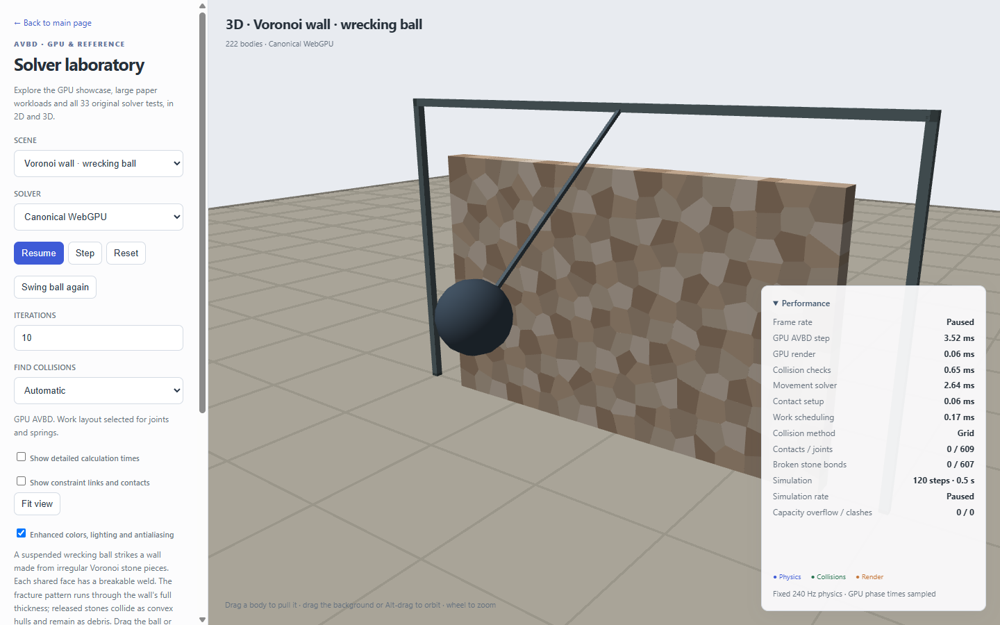](test-results/screenshots/voronoi-120.png)<br>216 convex stones fill a bounded Voronoi partition; shared faces carry breakable welds. | [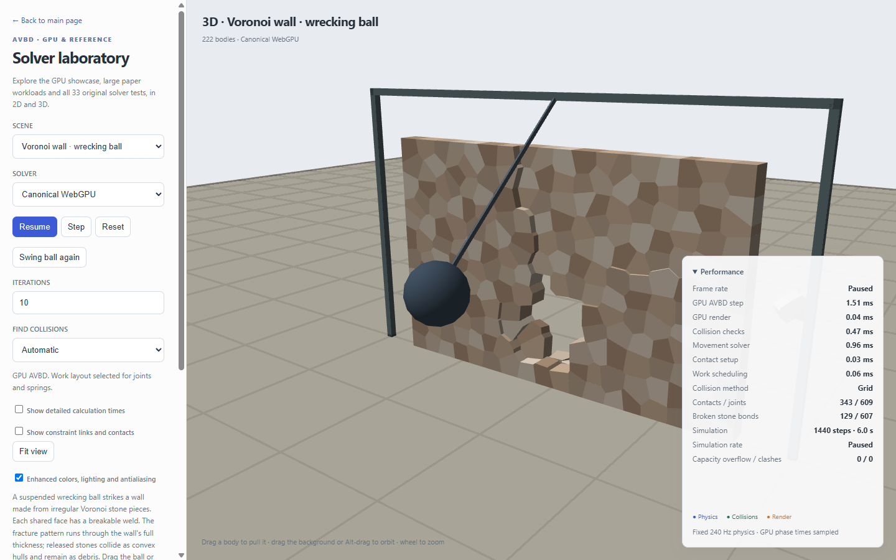](test-results/screenshots/voronoi-1440.png)<br>[Play the demolition](index.html?demo=canonical&scene=3d-voronoi-demolition&backend=gpu). Released stones remain physical debris. |

| Mixed collider gallery                                                                                                                                                                                                                                            | Chain-mail ring spacing                                                                                                                                                                                                                                                           |
| ----------------------------------------------------------------------------------------------------------------------------------------------------------------------------------------------------------------------------------------------------------------- | --------------------------------------------------------------------------------------------------------------------------------------------------------------------------------------------------------------------------------------------------------------------------------- |
| [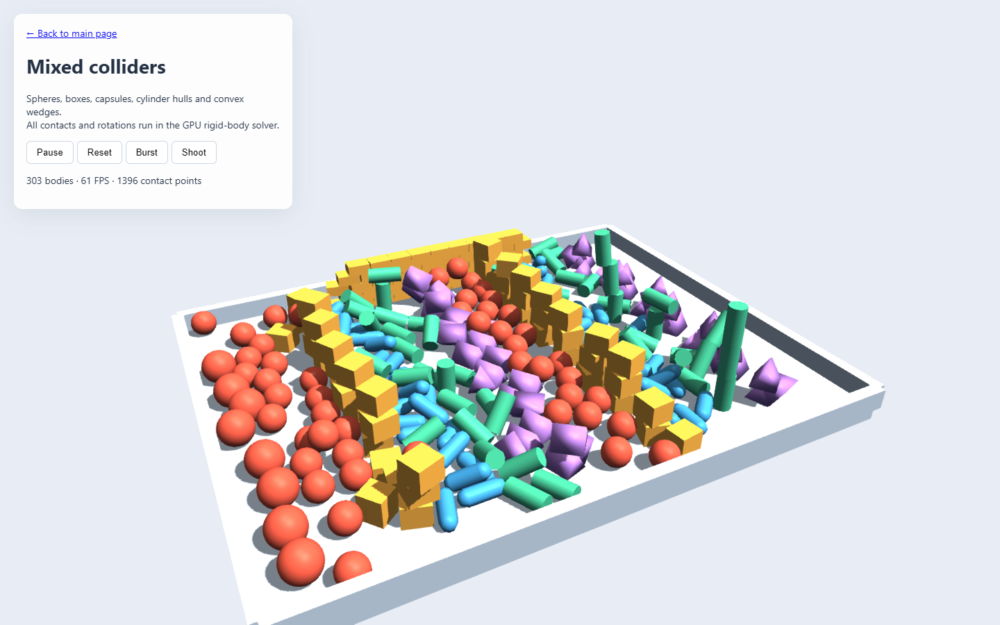](test-results/screenshots/mixed-gallery-settled.png)<br>Babylon meshes follow the GPU poses, with visible contacts and shadows. | [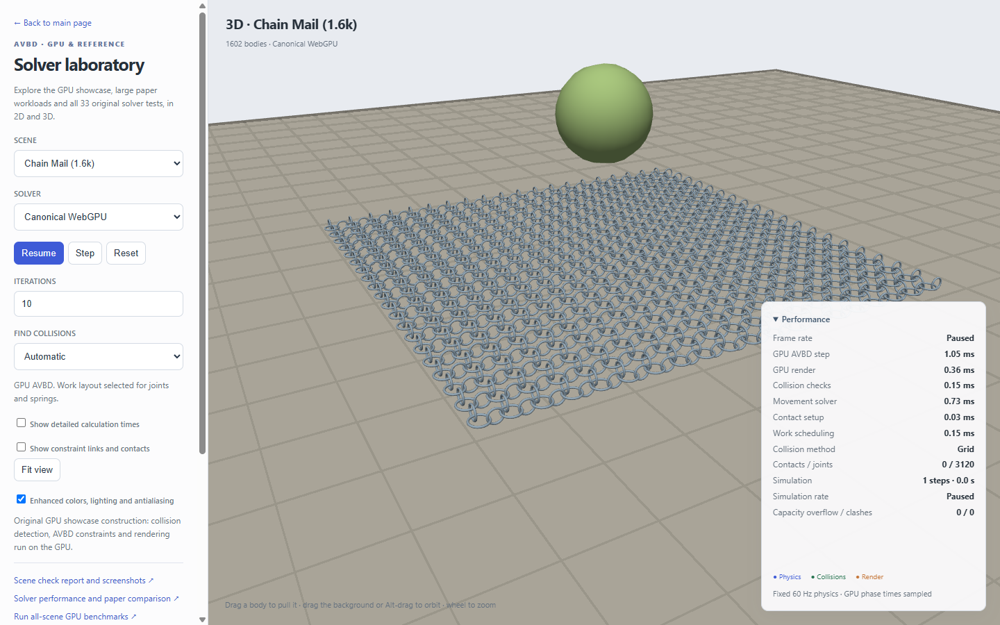](test-results/screenshots/chainmail-rest.png)<br>Ring sizes follow the link spacing. The net uses jointed rigid proxies; the donuts are decorative geometry. |

### Destruction and large scenes

| Castle siege                                                                                                                                                                                                                     | 100,000-brick impact                                                                                                                                                                                                                                     |
| -------------------------------------------------------------------------------------------------------------------------------------------------------------------------------------------------------------------------------- | -------------------------------------------------------------------------------------------------------------------------------------------------------------------------------------------------------------------------------------------------------- |
| [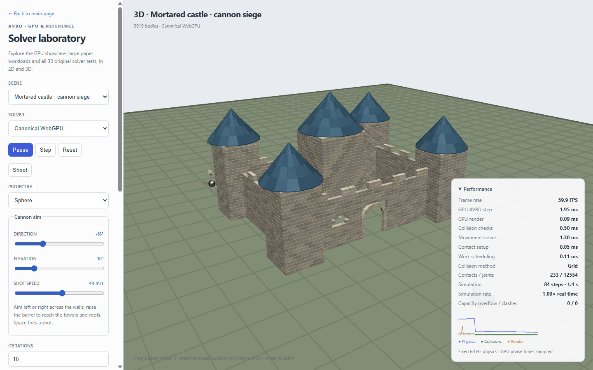](test-results/screenshots/route-cannon.png)<br>Breakable mortar holds the castle together until a cannonball hits. | [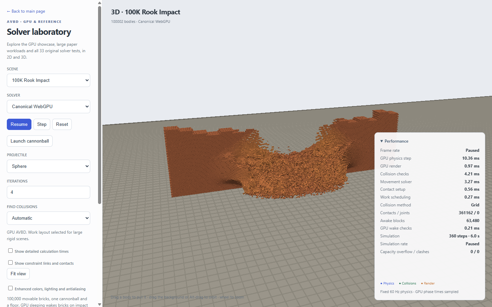](test-results/screenshots/rook-360.png)<br>After six simulated seconds, fallen bricks fill the opening while the outer wall remains standing. |

| 110K brick ring                                                                                                                                                                                                                                  | Half-million brick walls                                                                                                                                                                                                                                                |
| ------------------------------------------------------------------------------------------------------------------------------------------------------------------------------------------------------------------------------------------------ | ----------------------------------------------------------------------------------------------------------------------------------------------------------------------------------------------------------------------------------------------------------------------- |
| [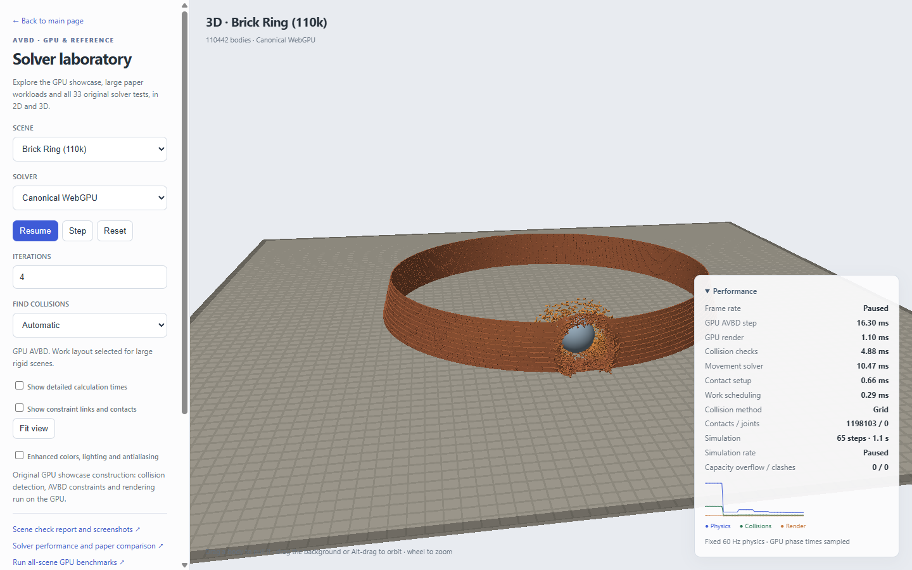](test-results/screenshots/showcase-brick-ring-110k-gpu.png)<br>A circular masonry wall with a localized impact. | [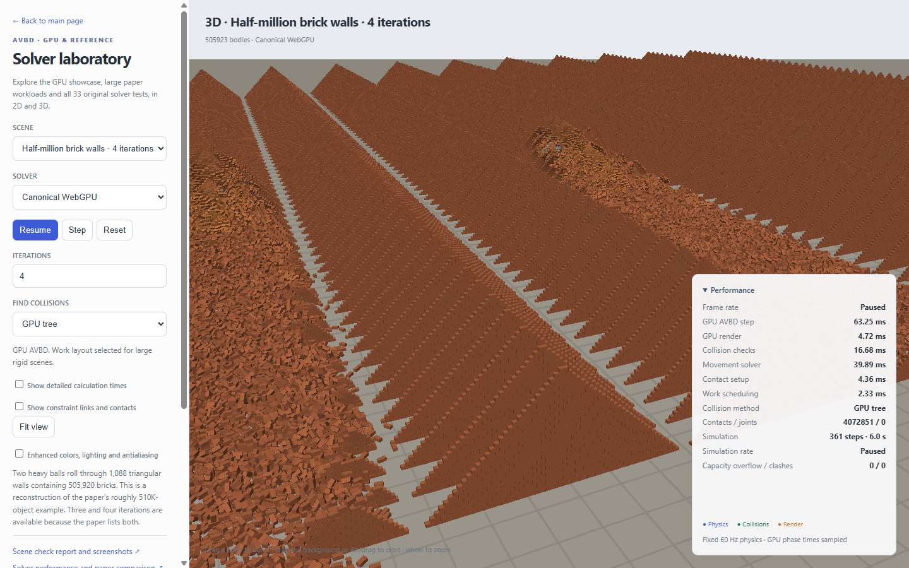](test-results/screenshots/paper-walls-510k-4-hploc-360.png)<br>505,923 bodies, four solver iterations and the HPLOC++ collision tree. |

| 100K box columns                                                                                                                                                                                                                                    | 32K box pile                                                                                                                                                                                                                                     |
| --------------------------------------------------------------------------------------------------------------------------------------------------------------------------------------------------------------------------------------------------- | ------------------------------------------------------------------------------------------------------------------------------------------------------------------------------------------------------------------------------------------------ |
| [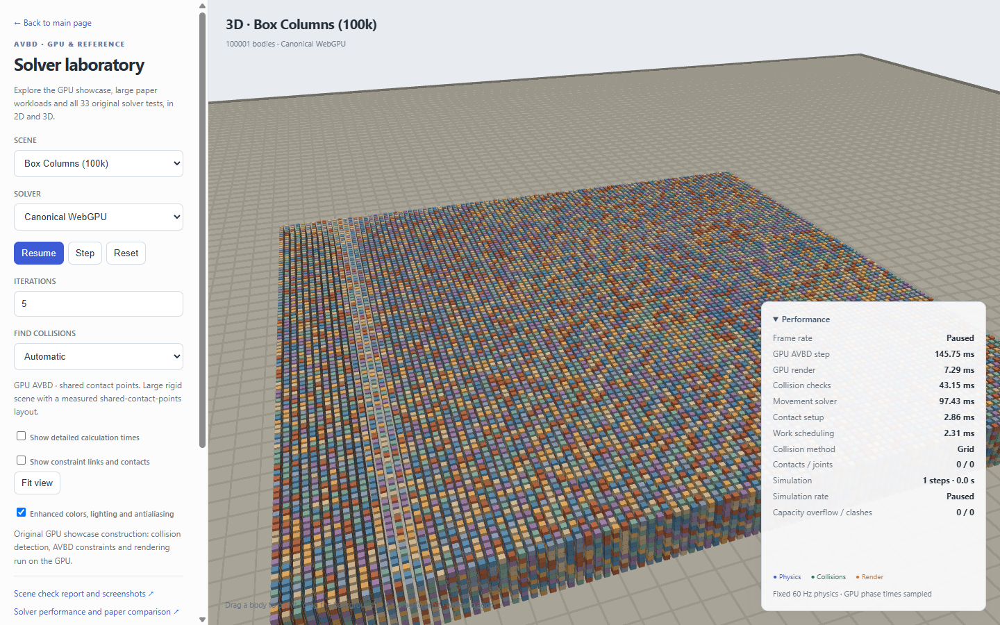](test-results/screenshots/columns-enhanced.png)<br>Five solver iterations, batch drawing and optional enhanced colors and lighting. | [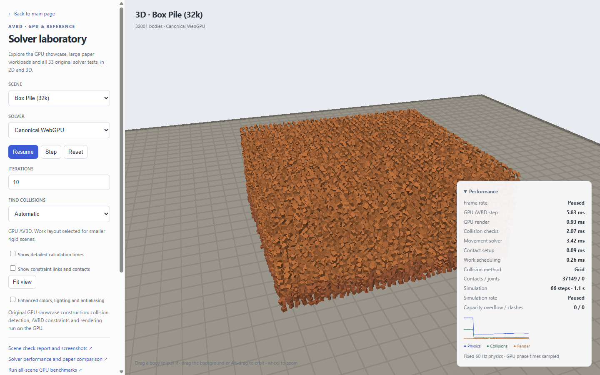](test-results/screenshots/showcase-box-pile-32k-gpu.png)<br>A dense contact workload for GPU collision detection and solving. |

| 2D slingshot siege                                                                                                                                                                                                                                  | 100K 2D collision stress test                                                                                                                                                                                                             |
| --------------------------------------------------------------------------------------------------------------------------------------------------------------------------------------------------------------------------------------------------- | ----------------------------------------------------------------------------------------------------------------------------------------------------------------------------------------------------------------------------------------- |
| [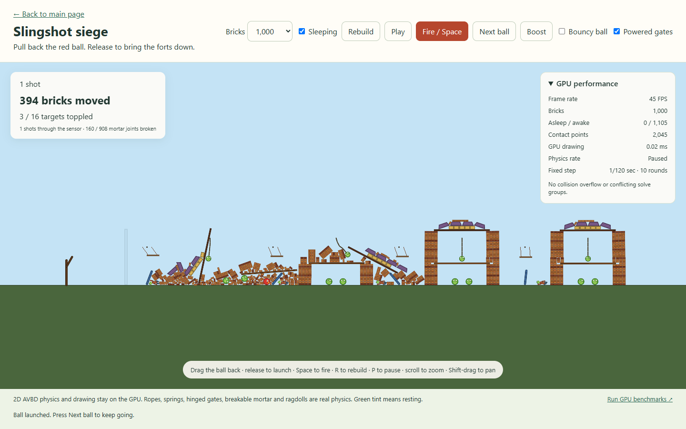](test-results/screenshots/slingshot-impact.png)<br>Breakable forts, ropes, springs, powered gates, sensors and ragdolls. | [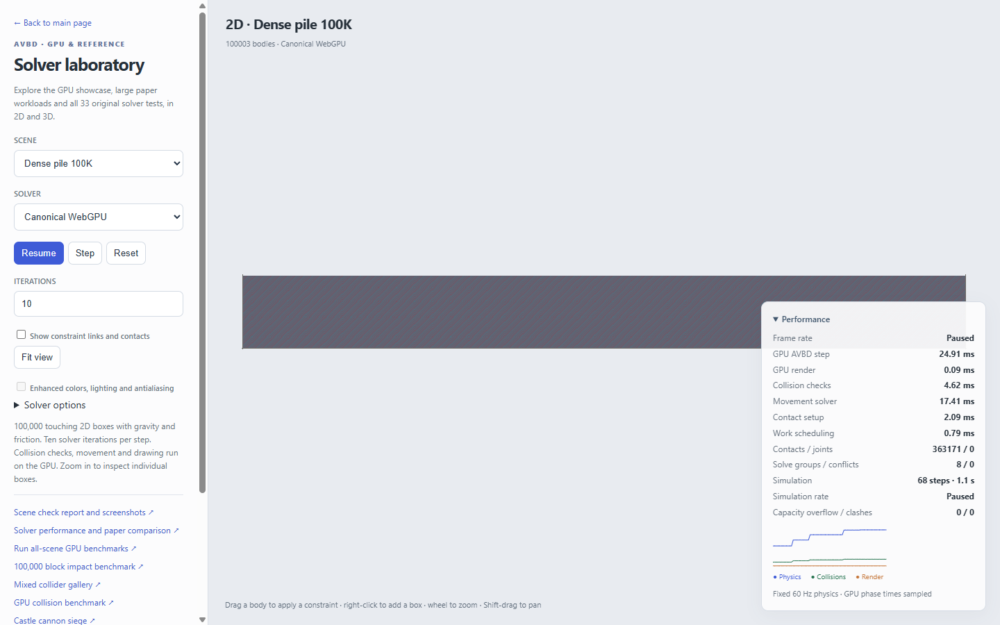](test-results/screenshots/2d-stress-pile-100k-gpu.png)<br>100,000 touching boxes with gravity, friction and GPU drawing. |

### Cloth and connected bodies

| Ragdolls on a rigid net                                                                                                                                                                                                                                                                                 | Persistent torn fabric                                                                                                                                                                                                                                                                    |
| ------------------------------------------------------------------------------------------------------------------------------------------------------------------------------------------------------------------------------------------------------------------------------------------------------- | ----------------------------------------------------------------------------------------------------------------------------------------------------------------------------------------------------------------------------------------------------------------------------------------- |
| [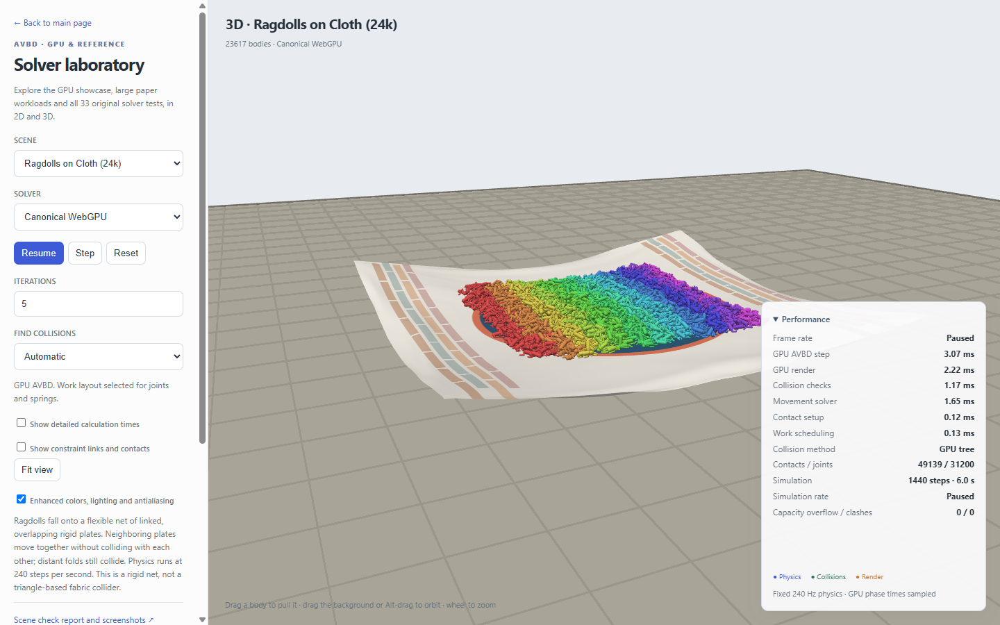](test-results/screenshots/showcase-ragdolls-on-cloth-24k-six-seconds.png)<br>Linked rigid plates catch the ragdolls; this scene uses five solver iterations. | [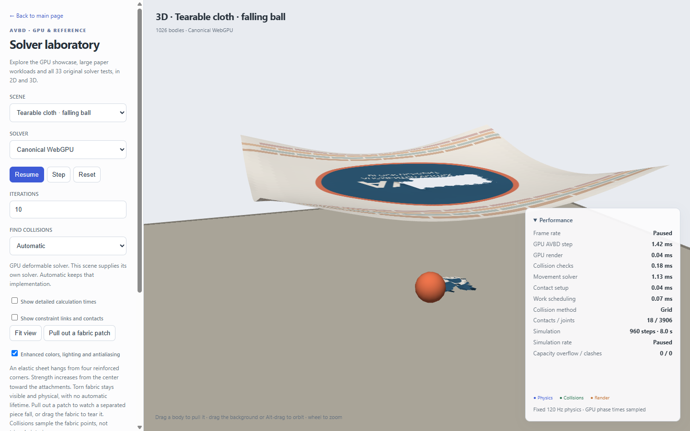](test-results/screenshots/cloth-fragments-960.png)<br>The detached patch falls and remains visible and physical, with no automatic lifetime. |

| Deformable cloth and 35K blocks                                                                                                                                                                                                         | Flag in the wind                                                                                                                                                                                                                                |
| --------------------------------------------------------------------------------------------------------------------------------------------------------------------------------------------------------------------------------------- | ----------------------------------------------------------------------------------------------------------------------------------------------------------------------------------------------------------------------------------------------- |
| [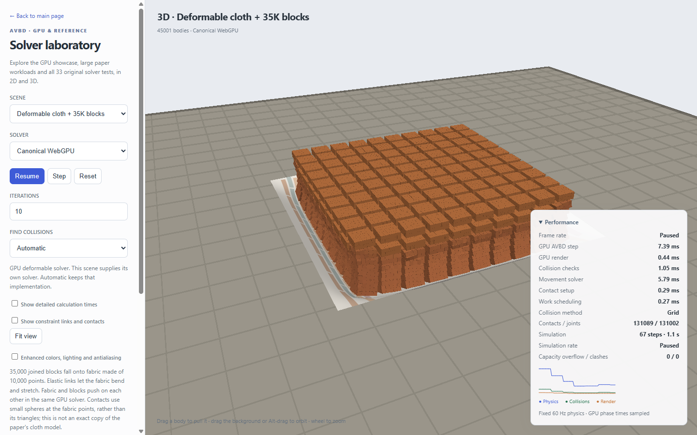](test-results/screenshots/paper-cloth-35k-gpu.png)<br>A spring-based fabric workload with point-sampled collisions. | [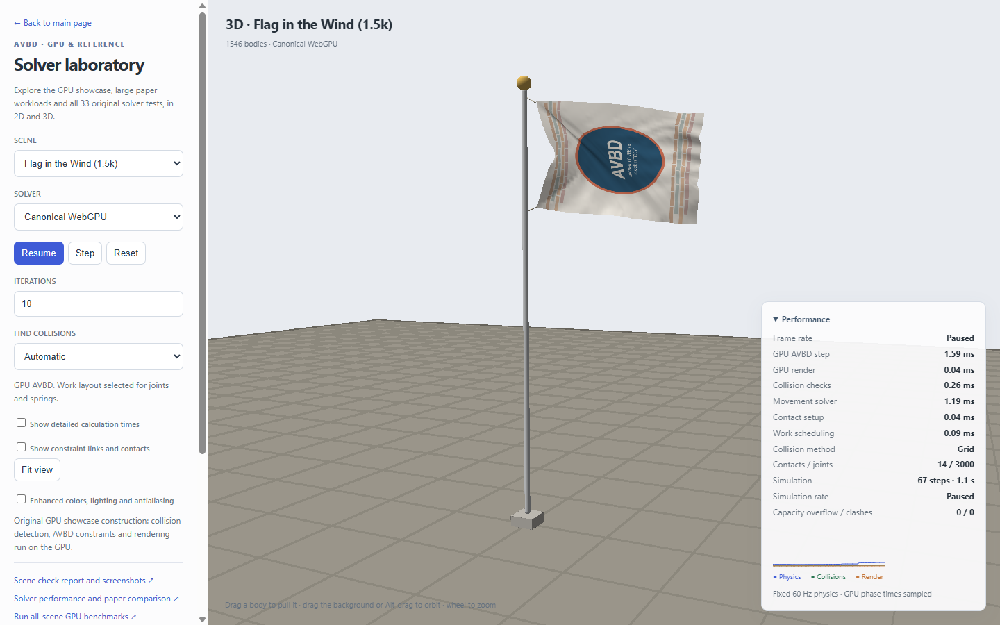](test-results/screenshots/showcase-flag-in-the-wind-1.5k-gpu.png)<br>Connected bodies form a flexible flag. |

| Chain mail                                                                                                                                                                                          | Jointed bridge                                                                                                                                                                                                   |
| --------------------------------------------------------------------------------------------------------------------------------------------------------------------------------------------------- | ---------------------------------------------------------------------------------------------------------------------------------------------------------------------------------------------------------------- |
| [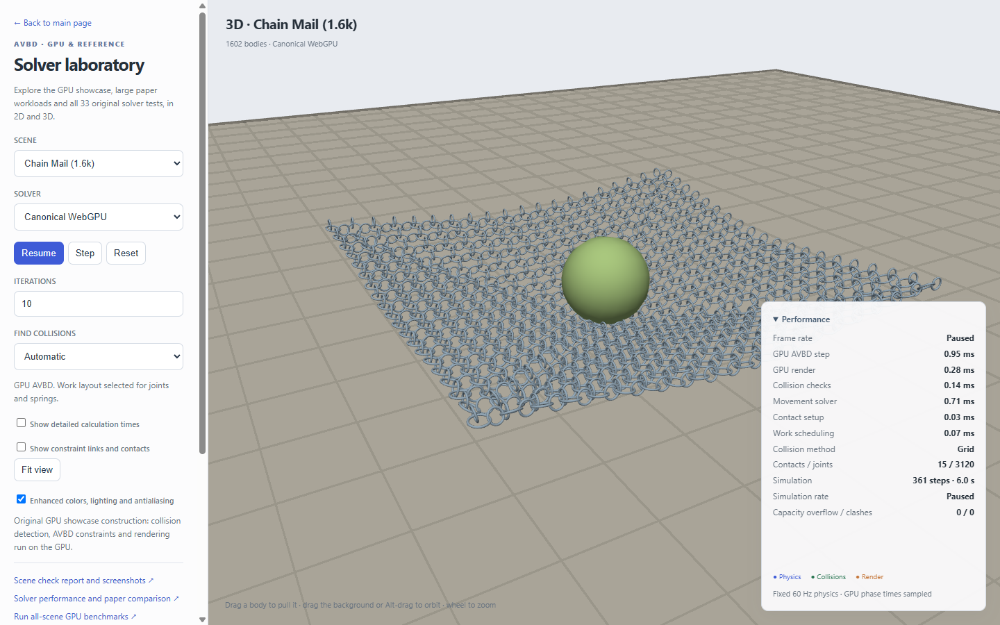](test-results/screenshots/chainmail-settled.png)<br>A network of rigid bodies connected by joints. | [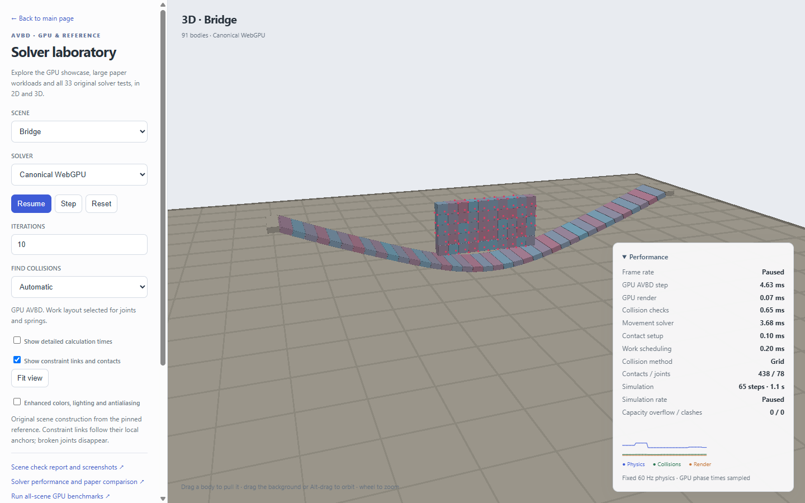](test-results/screenshots/3d-bridge-gpu.png)<br>Anchored bodies and joints carry the bridge load. |

| 3D rope                                                                                                                                                                                               | 2D soft body                                                                                                                                                                                                                                   |
| ----------------------------------------------------------------------------------------------------------------------------------------------------------------------------------------------------- | ---------------------------------------------------------------------------------------------------------------------------------------------------------------------------------------------------------------------------------------------- |
| [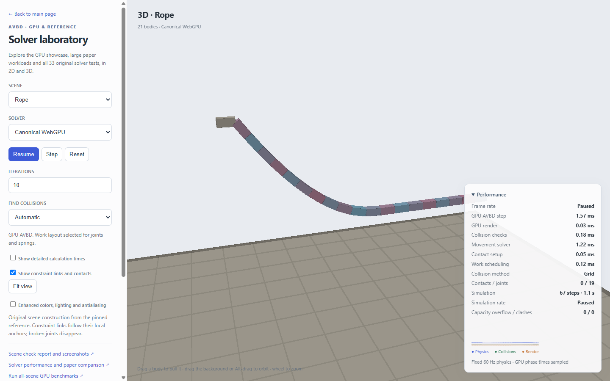](test-results/screenshots/3d-rope-gpu.png)<br>A rope built from connected rigid bodies. | [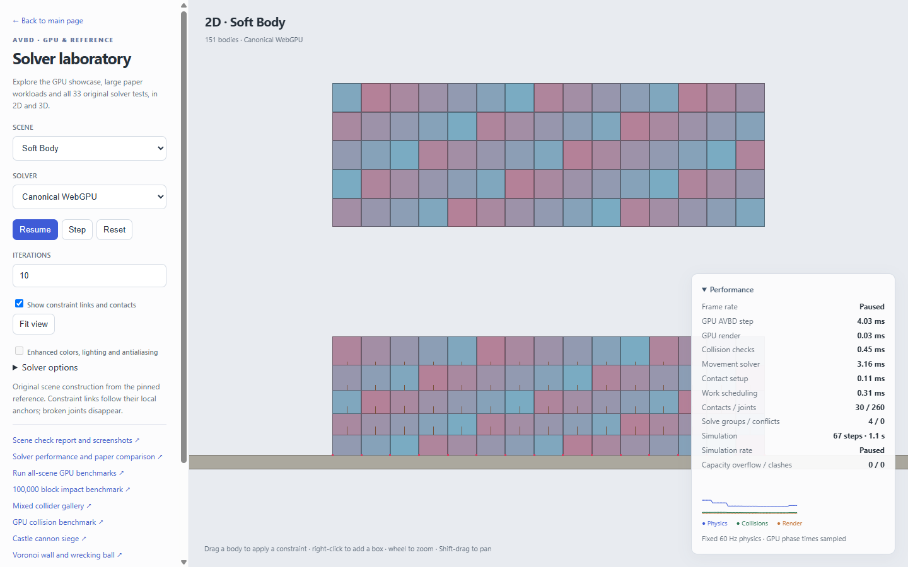](test-results/screenshots/2d-soft-body-gpu.png)<br>Compliant constraints connect the bodies into a deformable structure. |

### Colliders, controls and rendering

| 3D convex hulls                                                                                                                                                                                                           | Mixed 2D colliders                                                                                                                                                                                                                     |
| ------------------------------------------------------------------------------------------------------------------------------------------------------------------------------------------------------------------------- | -------------------------------------------------------------------------------------------------------------------------------------------------------------------------------------------------------------------------------------- |
| [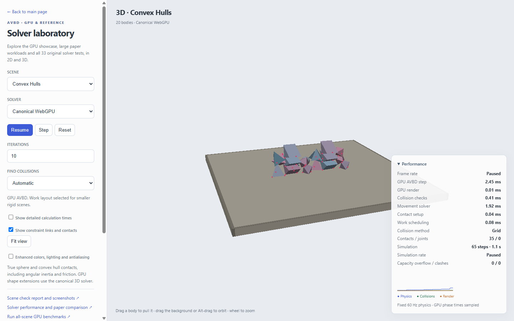](test-results/screenshots/3d-convex-hulls-gpu.png)<br>Custom hull geometry participates in the GPU contact solver. | [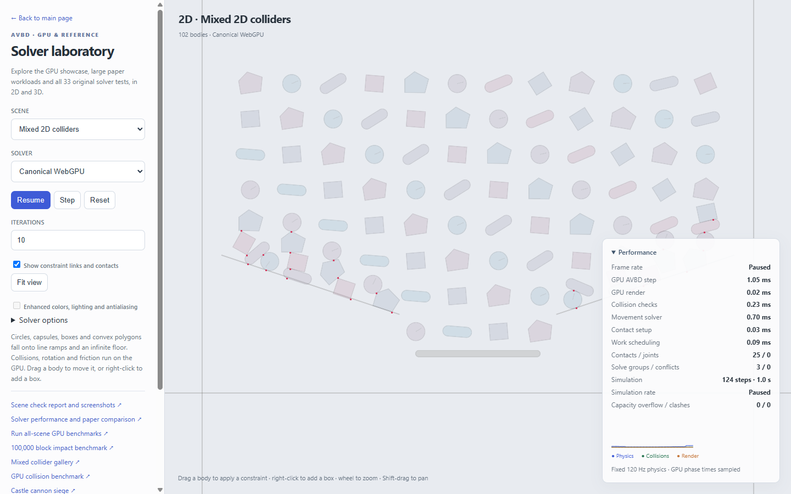](test-results/screenshots/2d-mixed-shapes-gpu.png)<br>Rounded and polygonal shapes share the same 2D world. |

| 3D hinges and motors                                                                                                                                                                                                                                   | 2D hinges and motors                                                                                                                                                                                                   |
| ------------------------------------------------------------------------------------------------------------------------------------------------------------------------------------------------------------------------------------------------------ | ---------------------------------------------------------------------------------------------------------------------------------------------------------------------------------------------------------------------- |
| [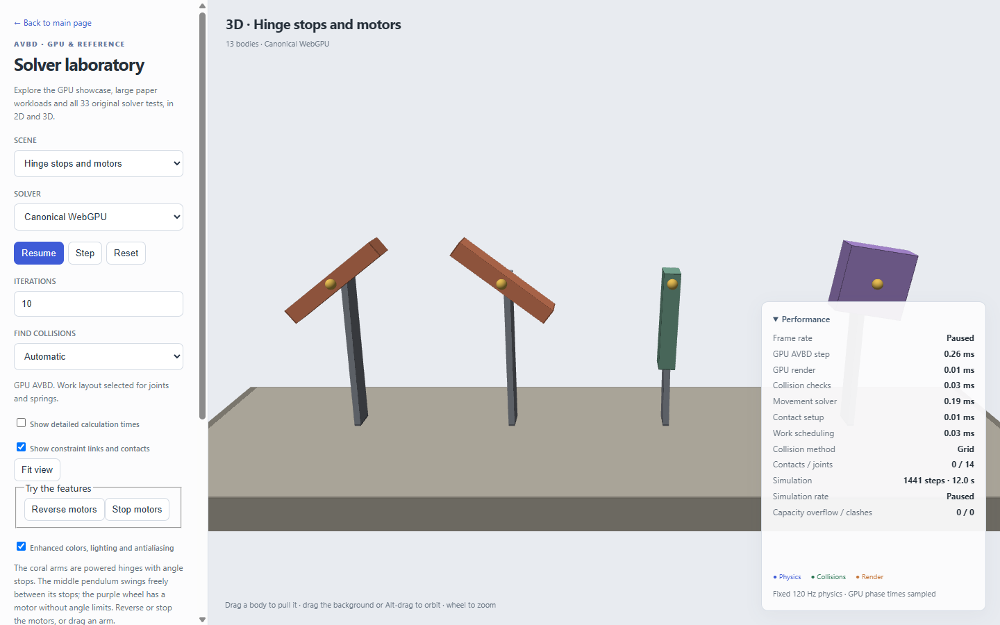](test-results/screenshots/3d-limited-hinges.png)<br>Angle stops, torque-limited motors and live reverse/brake controls. | [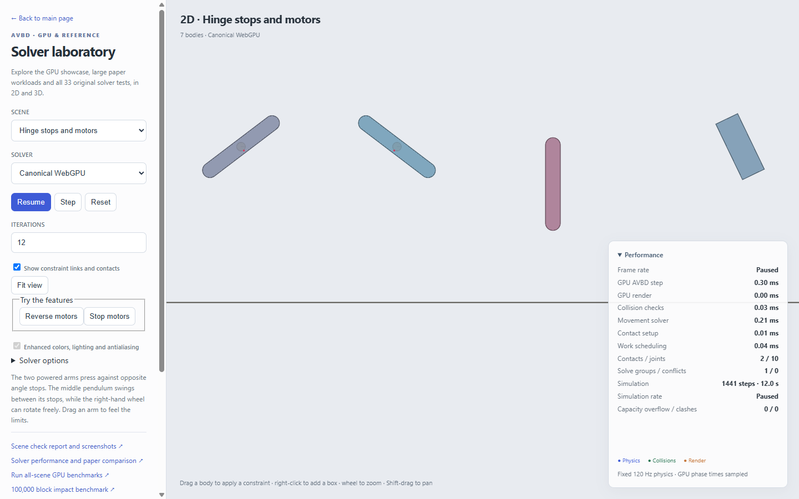](test-results/screenshots/2d-limited-hinges.png)<br>The same motor and limit controls in a planar world. |

| 3D triggers and masks                                                                                                                                                                                                                                                         | 2D triggers and masks                                                                                                                                                                                                                  |
| ----------------------------------------------------------------------------------------------------------------------------------------------------------------------------------------------------------------------------------------------------------------------------- | -------------------------------------------------------------------------------------------------------------------------------------------------------------------------------------------------------------------------------------- |
| [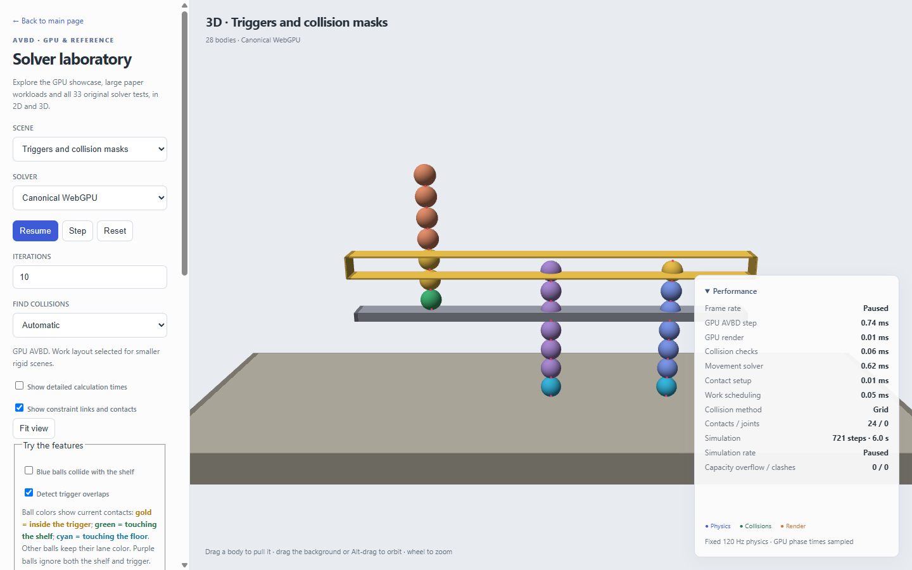](test-results/screenshots/3d-triggers-and-masks.png)<br>Non-solving overlap detection, collision filtering and ray/sphere casts. | [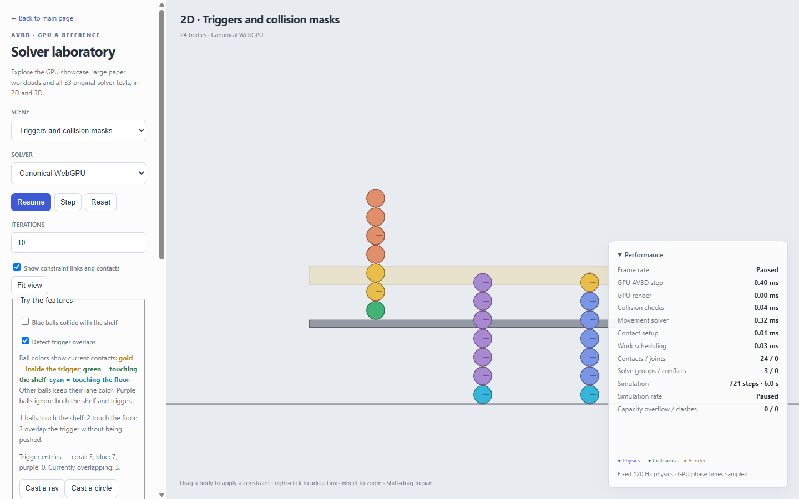](test-results/screenshots/2d-triggers-and-masks.png)<br>Live mask changes, trigger events and ray/circle casts. |

| D20 collision benchmark                                                                                                                                                                                                                             | Direct GPU pose rendering                                                                                                                                                                                                                                                         |
| --------------------------------------------------------------------------------------------------------------------------------------------------------------------------------------------------------------------------------------------------- | --------------------------------------------------------------------------------------------------------------------------------------------------------------------------------------------------------------------------------------------------------------------------------- |
| [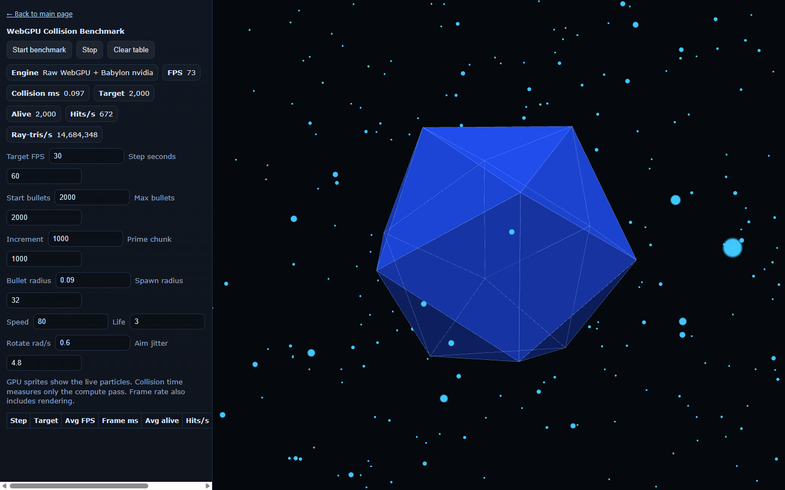](test-results/screenshots/collision-sprites.png)<br>GPU particles are drawn as sprites around the rotating collision target. | [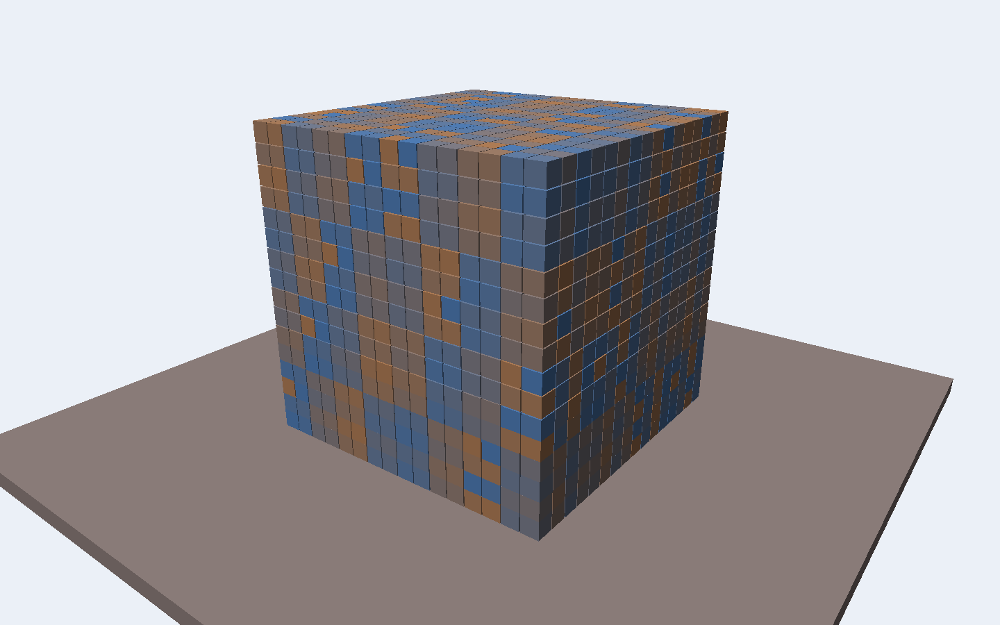](test-results/screenshots/readme-direct-gpu.png)<br>The [rendering example below](#direct-gpu-rendering) draws 4,096 boxes without downloading their poses. |

## Complete falling-box example

Add this HTML to a bundled Babylon application and use `src/main.js` as its entry:

```html
<style>
  html,
  body {
    margin: 0;
    width: 100%;
    height: 100%;
    overflow: hidden;
  }
  #canvas {
    width: 100%;
    height: 100%;
    display: block;
    touch-action: none;
  }
</style>
<canvas id="canvas"></canvas>
<script type="module" src="/src/main.js"></script>
```

```js
// src/main.js
import {
  Engine,
  Scene,
  ArcRotateCamera,
  HemisphericLight,
  MeshBuilder,
  Vector3,
} from "@babylonjs/core";
import { AvbdPhysics, AvbdPhysicsAggregate, AvbdShapeType } from "avbd-babylon";

const canvas = document.getElementById("canvas");
const engine = new Engine(canvas, true);
const scene = new Scene(engine);
const camera = new ArcRotateCamera(
  "camera",
  -Math.PI / 2,
  Math.PI / 3,
  12,
  new Vector3(0, 2, 0),
  scene,
);
camera.attachControl(canvas, true);
new HemisphericLight("light", new Vector3(0, 1, 0), scene);

const physics = await AvbdPhysics.create({
  scene,
  gravity: new Vector3(0, -9.81, 0),
  timeStep: 1 / 60,
  iterations: 10,
  capacity: 64,
});
const floor = MeshBuilder.CreateBox(
  "floor",
  { width: 20, height: 1, depth: 20 },
  scene,
);
floor.position.y = -0.5;
new AvbdPhysicsAggregate(floor, AvbdShapeType.BOX, { mass: 0 }, scene);
const box = MeshBuilder.CreateBox("box", { size: 1 }, scene);
box.position.y = 4;
const fallingBox = new AvbdPhysicsAggregate(
  box,
  AvbdShapeType.BOX,
  { mass: 2, friction: 0.6 },
  scene,
);
fallingBox.body.setAngularVelocity(new Vector3(0, 1, 0.5));

engine.runRenderLoop(() => scene.render());
const resize = () => engine.resize();
window.addEventListener("resize", resize);
window.addEventListener(
  "pagehide",
  () => {
    window.removeEventListener("resize", resize);
    scene.dispose(); // also disposes its AVBD world
    engine.dispose();
  },
  { once: true },
);
```

The world attaches fixed-step simulation and disposal to the scene. The render
loop only calls `scene.render()`; do not also call `physics.step()` there.
Pose synchronization is asynchronous, with one outstanding copy and at most
three catch-up physics steps per rendered frame.

Create **all aggregates before the first step or `initialize()`**. Reading
`bodyBuffer`, `body.gpuIndex` or `solverDecision` also initializes the world.
Reserve reusable bodies for objects you plan to launch later.

## World and body settings

| World option      | Default         | Use                                                      |
| ----------------- | --------------- | -------------------------------------------------------- |
| `scene`           | None            | Attach updates and disposal to a Babylon scene.          |
| `gravity`         | `[0, -10, 0]`   | `Vector3` or a three-component array; y up by default.   |
| `timeStep`        | `1 / 60`        | Simulated seconds advanced by each `step()`.             |
| `iterations`      | `10`            | Solving rounds per fixed step.                           |
| `capacity`        | `4096`          | Aggregate count, including static and reserved bodies.   |
| `autoAttach`      | `true`          | Set false for a manually managed loop.                   |
| `syncMeshes`      | `true`          | Asynchronously mirror GPU poses to Babylon meshes.       |
| `maxSyncedBodies` | `2048`          | Guard against mirroring a huge scene one mesh at a time. |
| `broadphase`      | `"auto"`        | Automatic, or explicit `"grid"` / `"hploc"`.             |
| `solverMode`      | `"auto"`        | Automatic GPU implementation selection.                  |
| `bvh`             | `{}`            | Tree options such as `{ rebuildInterval: 64 }`.          |
| `device`          | Created by AVBD | Optional caller-owned GPUDevice.                         |

Aggregate options include `mass` (default 1), `friction` (0.6), `restitution`
(0, valid range 0–1), `isTrigger` (false), `allowSleep`, `group`, `collidesWith`
and `sync` (true). Set mesh position, rotation and positive scale before creating
its aggregate. Meshes must be unparented; bake parent transforms first. Later
visual scaling does not resize the collider.

The final aggregate argument can be the scene or the world, or be omitted when
the mesh's scene has an AVBD world. Supported Babylon `PhysicsShapeType` enum
values work too. Add bodies before initialization:

```js
import { PhysicsShapeType } from "@babylonjs/core";

const spherePhysics = physics.addAggregate(
  sphereMesh,
  PhysicsShapeType.SPHERE,
  { mass: 3, friction: 0.5 },
);
```

## Mixed collider gallery

Save this helper as `src/mixed-gallery.js`. It recreates a small version of the
mixed gallery: 30 dynamic objects, a static floor and all five collider types.
Replace the complete example's world/floor/box block with
`const { physics } = await createMixedColliderScene(scene)` and import the helper.
Keep its camera, light and render loop; omit the `fallingBox` command.

```js
// src/mixed-gallery.js
import {
  MeshBuilder,
  Quaternion,
  StandardMaterial,
  Color3,
} from "@babylonjs/core";
import { AvbdPhysics, AvbdShapeType } from "avbd-babylon";

export async function createMixedColliderScene(scene) {
  const physics = await AvbdPhysics.create({
    scene,
    capacity: 31,
    iterations: 10,
  });
  const floor = MeshBuilder.CreateBox(
    "floor",
    { width: 18, height: 1, depth: 12 },
    scene,
  );
  floor.position.y = -0.5;
  physics.addAggregate(floor, AvbdShapeType.BOX, { mass: 0, friction: 0.7 });
  const kinds = [
    [AvbdShapeType.BOX, (n) => MeshBuilder.CreateBox(n, { size: 0.8 }, scene)],
    [
      AvbdShapeType.SPHERE,
      (n) =>
        MeshBuilder.CreateSphere(n, { diameter: 0.8, segments: 12 }, scene),
    ],
    [
      AvbdShapeType.CAPSULE,
      (n) =>
        MeshBuilder.CreateCapsule(
          n,
          {
            height: 1.2,
            radius: 0.2,
            tessellation: 8,
            subdivisions: 2,
            capSubdivisions: 2,
          },
          scene,
        ),
    ],
    [
      AvbdShapeType.CYLINDER,
      (n) =>
        MeshBuilder.CreateCylinder(
          n,
          {
            height: 1,
            diameter: 0.6,
            tessellation: 12,
          },
          scene,
        ),
    ],
    [
      AvbdShapeType.CONVEX_HULL,
      (n) => MeshBuilder.CreatePolyhedron(n, { type: 0, size: 0.5 }, scene),
    ],
  ];
  const materials = ["#e3a044", "#de5656", "#4bbedd", "#59c9a6", "#b59be6"].map(
    (color, i) => {
      const material = new StandardMaterial(`shape-${i}`, scene);
      material.diffuseColor = Color3.FromHexString(color);
      return material;
    },
  );
  const bodies = [];
  for (let row = 0; row < 6; row++) {
    for (let kind = 0; kind < kinds.length; kind++) {
      const [type, createMesh] = kinds[kind];
      const mesh = createMesh(`shape-${row}-${kind}`);
      mesh.position.set(
        (kind - 2) * 2.1,
        1.2 + Math.floor(row / 3) * 1.7,
        ((row % 3) - 1) * 2,
      );
      mesh.rotationQuaternion = Quaternion.FromEulerAngles(
        0.15 * row,
        0.3 * kind,
        0.1 * row,
      );
      mesh.material = materials[kind];
      bodies.push(physics.addAggregate(mesh, type, { mass: 1, friction: 0.6 }));
    }
  }
  return { physics, bodies };
}
```

Sphere, box and capsule collisions use native geometry. Capsules are exact rounded
segments, along the mesh's local Y axis, with equal X/Z diameters. Their height
includes both end caps. Rotate the mesh to orient the capsule in the world.
Cylinders and custom meshes use convex hulls simplified to 32 vertices. A convex
hull fills input concavities.

## Brick wall and reusable cannonball

Save this as `src/brick-wall.js` and use it instead of the small example's body
creation. It creates 96 bricks, a floor and one projectile before initialization.
Call `shoot()` from a button or keyboard handler.

This is a loose brick wall. The castle's breakable mortar uses native joints;
the [native constraint examples](#joints-welds-springs-ropes-and-ragdolls) show that API.

```js
// src/brick-wall.js
import { MeshBuilder, Vector3, Quaternion } from "@babylonjs/core";
import { AvbdPhysics, AvbdShapeType } from "avbd-babylon";

export async function createBrickWallScene(scene) {
  const physics = await AvbdPhysics.create({
    scene,
    capacity: 98,
    iterations: 10,
  });
  const floor = MeshBuilder.CreateBox(
    "floor",
    { width: 24, height: 1, depth: 24 },
    scene,
  );
  floor.position.y = -0.5;
  physics.addAggregate(floor, AvbdShapeType.BOX, { mass: 0, friction: 0.7 });
  const bricks = [];
  for (let row = 0; row < 8; row++) {
    for (let column = 0; column < 12; column++) {
      const mesh = MeshBuilder.CreateBox(
        `brick-${row}-${column}`,
        {
          width: 0.9,
          height: 0.45,
          depth: 0.6,
        },
        scene,
      );
      mesh.position.set(
        (column - 5.5) * 0.9 + (row % 2) * 0.45,
        0.225 + row * 0.45,
        0,
      );
      bricks.push(
        physics.addAggregate(mesh, AvbdShapeType.BOX, {
          mass: 1,
          friction: 0.65,
        }),
      );
    }
  }
  const ball = MeshBuilder.CreateSphere(
    "cannonball",
    { diameter: 1.2, segments: 16 },
    scene,
  );
  ball.position.set(0, 1.3, -8);
  const projectile = physics.addAggregate(ball, AvbdShapeType.SPHERE, {
    mass: 20,
    friction: 0.4,
  });
  function shoot() {
    projectile.body.teleport(new Vector3(0, 1.3, -8), Quaternion.Identity());
    projectile.body.setAngularVelocity(Vector3.Zero());
    projectile.body.setLinearVelocity(new Vector3(0, 0, 22));
  }
  return { physics, bricks, projectile, shoot };
}
```

Reusing a projectile preserves its GPU slot. `teleport()` retains velocity,
so set linear and angular velocity explicitly for each shot. Changing the
visual mesh position after initialization does not move the physical body.

## Large pile with thin instances

This helper draws 2,000 unit boxes through one thin-instance mesh. Each collider
still has a hidden Babylon mesh during setup. Save as `src/box-pile.js`, use it
in place of the small example's body creation, and increase the camera radius.

```js
// src/box-pile.js
import { MeshBuilder, Matrix, Quaternion, Vector3 } from "@babylonjs/core";
import { AvbdPhysics, AvbdShapeType } from "avbd-babylon";

export async function createBoxPileScene(scene, count = 2000) {
  const physics = await AvbdPhysics.create({
    scene,
    capacity: count + 1,
    iterations: 10,
    syncMeshes: false,
  });
  const floor = MeshBuilder.CreateBox(
    "floor",
    { width: 30, height: 1, depth: 30 },
    scene,
  );
  floor.position.y = -0.5;
  physics.addAggregate(floor, AvbdShapeType.BOX, { mass: 0, sync: false });
  const source = MeshBuilder.CreateBox("drawn-boxes", { size: 1 }, scene);
  const matrices = new Float32Array(count * 16),
    bodies = [];
  for (let i = 0; i < count; i++) {
    const mesh = MeshBuilder.CreateBox(`collider-${i}`, { size: 1 }, scene);
    mesh.position.set(
      ((i % 10) - 4.5) * 1.05,
      0.55 + Math.floor(i / 100) * 1.05,
      ((Math.floor(i / 10) % 10) - 4.5) * 1.05,
    );
    mesh.isVisible = false;
    bodies.push(
      physics.addAggregate(mesh, AvbdShapeType.BOX, {
        mass: 1,
        friction: 0.6,
        sync: false,
      }),
    );
    mesh.computeWorldMatrix(true).copyToArray(matrices, i * 16);
  }
  physics.initialize();
  const mirroredBodies = bodies.map((a) => a.body);
  source.thinInstanceSetBuffer("matrix", matrices, 16, false);
  source.thinInstanceRefreshBoundingInfo();
  const position = Vector3.Zero(),
    rotation = Quaternion.Identity();
  const scale = Vector3.One(),
    matrix = Matrix.Identity();
  let pending = false;
  scene.onBeforeRenderObservable.add(() => {
    if (pending) return;
    pending = true;
    physics
      .readBodies(mirroredBodies)
      .then((poses) => {
        if (scene.isDisposed) return;
        for (let i = 0; i < mirroredBodies.length; i++) {
          const o = i * 40;
          position.set(poses[o], poses[o + 1], poses[o + 2]);
          rotation.set(poses[o + 4], poses[o + 5], poses[o + 6], poses[o + 7]);
          Matrix.ComposeToRef(scale, rotation, position, matrix);
          matrix.copyToArray(matrices, i * 16);
        }
        source.thinInstanceBufferUpdated("matrix");
        source.thinInstanceRefreshBoundingInfo();
      })
      .catch((error) => {
        if (!scene.isDisposed) console.error(error);
      })
      .finally(() => {
        pending = false;
      });
  });
  return { physics, bodies, source };
}
```

Instancing reduces drawing work. This bridge reads poses, calculates
matrices on the CPU, uploads them and updates bounds. It assumes centered unit
boxes; custom hulls require the aggregate's center and principal-frame transform.

For 100K–500K bodies, use a custom renderer reading `physics.bodyBuffer` on the
**same GPUDevice** and omit pose readbacks. Spatial sorting changes GPU order;
use `aggregate.body.gpuIndex` after initialization. The adapter does not
bind that storage buffer to Babylon thin instances automatically. Native
laboratory builders also avoid making one Babylon mesh per collider. See
[rendering at scale](docs/README.md#choose-a-rendering-path) for the body layout,
renderer source and coordinate conventions.

## Direct GPU rendering

This example draws a box world in one instanced WebGPU draw call. The vertex
shader reads AVBD's live positions, quaternions and sizes. No pose readback,
CPU transform loop or per-frame instance-matrix upload is needed.

Save it as `src/direct-gpu.js` in a bundled application. The scene builder and
renderer share one device. Babylon's matrix helpers supply the camera math;
the drawing uses a WebGPU canvas. Call `createDirectGpuExample(canvas)` to
start, and call its `dispose()` when removing the view.

```js
// src/direct-gpu.js
import { Matrix, Vector3 } from "@babylonjs/core/Maths/math.vector.js";
import { AvbdScene3D, createWebGPUDevice } from "avbd-babylon/native";

const boxShader = `
struct Camera { vp: mat4x4f }
@group(0) @binding(0) var<storage, read> bodies: array<vec4f>;
@group(0) @binding(1) var<uniform> camera: Camera;
struct VertexOut {
  @builtin(position) position: vec4f,
  @location(0) normal: vec3f,
  @location(1) color: vec3f,
}
fn rotate(q: vec4f, v: vec3f) -> vec3f {
  return v + 2. * cross(q.xyz, cross(q.xyz, v) + q.w * v);
}
@vertex fn vertex(@builtin(vertex_index) v: u32,
                  @builtin(instance_index) instance: u32) -> VertexOut {
  let corners = array<vec3f, 8>(
    vec3f(-.5,-.5,-.5), vec3f(.5,-.5,-.5),
    vec3f(.5,.5,-.5), vec3f(-.5,.5,-.5),
    vec3f(-.5,-.5,.5), vec3f(.5,-.5,.5),
    vec3f(.5,.5,.5), vec3f(-.5,.5,.5));
  let indices = array<u32, 36>(
    0,2,1, 0,3,2, 4,5,6, 4,6,7,
    0,4,7, 0,7,3, 1,2,6, 1,6,5,
    0,1,5, 0,5,4, 3,7,6, 3,6,2);
  let normals = array<vec3f, 6>(
    vec3f(0,0,-1), vec3f(0,0,1), vec3f(-1,0,0),
    vec3f(1,0,0), vec3f(0,-1,0), vec3f(0,1,0));
  // A 3D body occupies ten vec4s (40 floats / 160 bytes).
  let offset = instance * 10u;
  let position = bodies[offset].xyz;
  let rotation = bodies[offset + 1u];
  let size = bodies[offset + 4u].xyz;
  var out: VertexOut;
  out.position = camera.vp * vec4f(position + rotate(rotation, corners[indices[v]] * size), 1);
  out.normal = rotate(rotation, normals[v / 6u]);
  let hue = f32(instance % 17u) / 17.;
  out.color = vec3f(.35 + .45 * hue, .55, .8 - .45 * hue);
  return out;
}
@fragment fn fragment(input: VertexOut) -> @location(0) vec4f {
  let light = .35 + .65 * max(dot(normalize(input.normal), normalize(vec3f(-.4,1,-.6))), 0.);
  return vec4f(input.color * light, 1);
}`;

export function createGpuBoxRenderer(canvas, getBinding) {
  const device = getBinding().device;
  const context = canvas.getContext("webgpu");
  const format = navigator.gpu.getPreferredCanvasFormat();
  context.configure({ device, format, alphaMode: "opaque" });
  const camera = device.createBuffer({
    size: 64,
    usage: GPUBufferUsage.UNIFORM | GPUBufferUsage.COPY_DST,
  });
  const module = device.createShaderModule({ code: boxShader });
  const pipeline = device.createRenderPipeline({
    layout: "auto",
    vertex: { module, entryPoint: "vertex" },
    fragment: { module, entryPoint: "fragment", targets: [{ format }] },
    primitive: { topology: "triangle-list", frontFace: "cw", cullMode: "back" },
    depthStencil: {
      format: "depth24plus",
      depthWriteEnabled: true,
      depthCompare: "less",
    },
  });
  let depth, width, height, bodyBuffer, bindGroup;
  return {
    draw(viewProjection) {
      const binding = getBinding();
      if (binding.device !== device || binding.stride !== 160)
        throw Error(
          "The renderer needs the same GPUDevice and the 3D body layout",
        );
      // Rebind if adding bodies caused the solver to grow its buffer.
      if (bodyBuffer !== binding.buffer) {
        bodyBuffer = binding.buffer;
        bindGroup = device.createBindGroup({
          layout: pipeline.getBindGroupLayout(0),
          entries: [
            { binding: 0, resource: { buffer: bodyBuffer } },
            { binding: 1, resource: { buffer: camera } },
          ],
        });
      }
      if (width !== canvas.width || height !== canvas.height) {
        depth?.destroy();
        width = canvas.width;
        height = canvas.height;
        depth = device.createTexture({
          size: [width, height],
          format: "depth24plus",
          usage: GPUTextureUsage.RENDER_ATTACHMENT,
        });
      }
      device.queue.writeBuffer(
        camera,
        0,
        new Float32Array(viewProjection.asArray()),
      );
      const encoder = device.createCommandEncoder();
      const pass = encoder.beginRenderPass({
        colorAttachments: [
          {
            view: context.getCurrentTexture().createView(),
            clearValue: { r: 0.92, g: 0.94, b: 0.97, a: 1 },
            loadOp: "clear",
            storeOp: "store",
          },
        ],
        depthStencilAttachment: {
          view: depth.createView(),
          depthClearValue: 1,
          depthLoadOp: "clear",
          depthStoreOp: "store",
        },
      });
      pass.setPipeline(pipeline);
      pass.setBindGroup(0, bindGroup);
      pass.draw(36, binding.count);
      pass.end();
      // Queue order makes this draw see the preceding physics step.
      device.queue.submit([encoder.finish()]);
    },
    dispose() {
      depth?.destroy();
      camera.destroy();
      context.unconfigure();
    },
  };
}

export async function createDirectGpuExample(canvas, count = 4096) {
  const { device } = await createWebGPUDevice({
    requiredLimits: { maxStorageBuffersPerShaderStage: 9 },
  });
  const world = new AvbdScene3D({ timeStep: 1 / 120, iterations: 5 });
  world.addBox([40, 1, 40], { density: 0, position: [0, -0.5, 0] });
  for (let i = 0; i < count; i++)
    world.addBox([1, 1, 1], {
      position: [
        ((i % 16) - 7.5) * 1.05,
        0.5 + Math.floor(i / 256) * 1.05,
        ((Math.floor(i / 16) % 16) - 7.5) * 1.05,
      ],
    });
  const gpu = world.createSolver(device);
  const drawing = createGpuBoxRenderer(canvas, () => ({
    device,
    buffer: gpu.bodyBuffer,
    stride: 160,
    count: gpu.bodyCount,
  }));
  let previous,
    accumulator = 0,
    request;
  function frame(now) {
    // Limit catch-up after a hidden tab; each executed step still uses 1/120 s.
    accumulator +=
      previous === undefined ? 0 : Math.min((now - previous) / 1000, 0.05);
    previous = now;
    while (accumulator >= 1 / 120) {
      gpu.step();
      accumulator -= 1 / 120;
    }
    const ratio = Math.min(devicePixelRatio || 1, 2);
    const width = Math.max(1, Math.round(canvas.clientWidth * ratio));
    const height = Math.max(1, Math.round(canvas.clientHeight * ratio));
    if (canvas.width !== width) canvas.width = width;
    if (canvas.height !== height) canvas.height = height;
    const view = Matrix.LookAtLH(
      new Vector3(24, 22, -32),
      new Vector3(0, 6, 0),
      Vector3.Up(),
    );
    const projection = Matrix.PerspectiveFovLH(
      0.75,
      canvas.width / canvas.height,
      0.1,
      200,
      true,
    );
    drawing.draw(view.multiply(projection));
    request = requestAnimationFrame(frame);
  }
  request = requestAnimationFrame(frame);
  return {
    device,
    gpu,
    drawing,
    stop() {
      cancelAnimationFrame(request);
    },
    dispose() {
      cancelAnimationFrame(request);
      drawing.dispose();
      gpu.destroy();
      device.destroy();
    },
  };
}
```

The helper renders centered **boxes** in GPU order, including the floor. Hulls,
capsules and other graphics need their own geometry and any center/principal-frame
conversion. The [demo renderer](demo/canonicalRenderer.js) shows those paths.
2D uses a different packed layout; see [the 2D renderer](demo/gpuRenderer2D.js).

For an existing Babylon world, pass `() => physics.getRenderBinding(device)`
to `createGpuBoxRenderer()`. Configure that world with `syncMeshes: false` and
`autoStep: false`, call `physics.step()` from your fixed-step loop, then call
`drawing.draw(viewProjection)`. Create each aggregate with `{ sync: false }`
when its Babylon mesh is only collider input. Keep the renderer and solver on
the same caller-owned device and use a canvas dedicated to this renderer.
Babylon thin instances use the separate matrix-upload example above.

Selective CPU inspection remains available independently of drawing:

```js
// Copy just these two bodies, in this order, rather than the whole world.
const poses = await physics.readBodies([projectile.body, gate.body]);
const projectilePosition = poses.subarray(0, 3);
const gatePosition = poses.subarray(40, 43);
```

## Native physics with any renderer

Import `avbd-babylon/native` for WebGPU physics without Babylon. These worlds
also work in module workers. Create bodies and constraints in a scene builder,
then create its GPU solver once. Rendering and simulation can share a GPUDevice.
The canonical web demos and solver benchmarks use these native solvers by default.

Both dimensions provide `gpu.body()`, `editBodies()`, `advance()`,
`readSelectedBodies()`, triggers, bounce, masks, sleeping, contact events and
shape queries. Native joints, welds, springs, hinges, motors, ropes, ragdolls and
fabric use the builders shown in the following sections. They do not require
Babylon meshes.

### Native 3D world

This builds a box pile, reusable capsule projectile, trigger volume and motorized
hinge. The default gravity axis is Y. Keep builder body references for bulk
edits; `gpu.body(reference)` creates a convenient handle only when requested.

```js
// src/portable-3d.js
import { AvbdScene3D, createWebGPUDevice } from "avbd-babylon/native";

export async function createPortable3D({ device, count = 4096 } = {}) {
  const ownsDevice = !device;
  if (!device) ({ device } = await createWebGPUDevice());
  const world = new AvbdScene3D({ gravity: -9.81, iterations: 5 });
  world.addBox([100, 1, 100], { mass: 0, position: [0, -0.5, 0] });
  const bodies = [];
  for (let i = 0; i < count; i++) {
    bodies.push(
      world.addBox([0.8, 0.8, 0.8], {
        position: [
          (i % 32) - 16,
          2 + Math.floor(i / 1024),
          (Math.floor(i / 32) % 32) - 16,
        ],
        friction: 0.6,
      }),
    );
  }
  const projectile = world.addCapsule(0.3, 1.4, {
    position: [-22, 4, 0],
    restitution: 0.3,
    allowSleep: false,
  });
  const sensor = world.addSphere(2, {
    mass: 0,
    position: [20, 2, 0],
    isTrigger: true,
  });
  const gate = world.addBox([4, 0.3, 0.3], { position: [0, 12, 0] });
  const hinge = world.addHinge(null, gate, {
    axisA: [0, 0, 1],
    axisB: [0, 0, 1],
    minAngle: -0.7,
    maxAngle: 0.7,
    motor: { speed: 1, maxTorque: 10 },
  });
  const gpu = world.createSolver(device, {
    broadphase: "auto",
    sleeping: true,
  });
  return {
    device,
    gpu,
    bodies,
    hinge,
    projectile: gpu.body(projectile),
    sensor: gpu.body(sensor),
    dispose() {
      gpu.destroy();
      if (ownsDevice) device.destroy();
    },
  };
}
```

`projectile.applyImpulse([20, 0, 0])` uses its current GPU centre. A world-point
argument also adds the appropriate rotation. `teleport(position, quaternion?)`
preserves velocity and clears old contact warm starts for that body. Position
means centre of mass; custom hulls use their principal frame. Numeric arguments
to `gpu.body()` are **GPU slots**; use builder references or `bodyIndex()` to
account for the initial spatial sorting.

### Native 2D world

2D uses xy vectors and scalar angles/angular velocities. Density sets mass from
shape area; zero density makes a static body. This example includes rounded
colliders, a floor, a finite ledge, a convex hull, a limited motorized hinge,
a spring and a breakable weld.

```js
// src/portable-2d.js
import { AvbdScene2D, createWebGPUDevice } from "avbd-babylon/native";

export async function createPortable2D({ device, count = 4096 } = {}) {
  const ownsDevice = !device;
  if (!device) ({ device } = await createWebGPUDevice());
  const world = new AvbdScene2D({ gravity: -9.81, iterations: 5 });
  world.addPlane([0, 1]);
  world.addSegment([-20, 4], [-16, 4]);
  world.addHull(
    [
      [-1, -1],
      [1, -1],
      [0, 1],
    ],
    { position: [22, 2] },
  );
  const bodies = [];
  for (let i = 0; i < count; i++) {
    bodies.push(
      world.addBox([0.8, 0.8], {
        position: [(i % 64) - 32, 2 + Math.floor(i / 64)],
      }),
    );
  }
  const projectile = world.addCapsule(0.3, 1.4, {
    position: [-40, 4],
    restitution: 0.3,
  });
  const sensor = world.addCircle(2, {
    density: 0,
    position: [40, 2],
    isTrigger: true,
  });
  const gate = world.addBox([3, 0.3], { position: [0, 80] });
  const hinge = world.addHinge(-1, gate, [0, 80], [0, 0], {
    minAngle: -0.7,
    maxAngle: 0.7,
    motor: { speed: 1, maxTorque: 10 },
  });
  const a = world.addCircle(0.4, { position: [-10, 80] });
  const b = world.addCircle(0.4, { position: [-8, 80] });
  world.addSpring(a, b);
  world.addJoint(a, b, [1, 0], [-1, 0], {
    stiffness: [Infinity, Infinity, Infinity],
    breakForce: 100,
  });
  const gpu = world.createSolver(device, { sleeping: true });
  return {
    device,
    gpu,
    bodies,
    hinge,
    projectile: gpu.body(projectile),
    sensor: gpu.body(sensor),
    dispose() {
      gpu.destroy();
      if (ownsDevice) device.destroy();
    },
  };
}
```

Both examples return the same style of body controls:

```js
projectile.setTrigger(false).setRestitution(0.5).setSleepEnabled(false);
projectile.setCollisionGroups(2, 1 | 2);
// 3D uses xyz; use [20, 0] for the 2D projectile.
projectile.applyImpulse([20, 0, 0]);
gpu.setMotor(hinge.motor.slot, { speed: -1, maxTorque: 10 });
```

### Bulk edits and GPU dispatches

Queue an array or generator of edits, then step or flush once. `editBodies()`
validates the whole batch before enqueueing it. A record applies a teleport
first, velocity setters next, then impulses and forces. Records for the same
body execute in order. Individual handle calls also join the pending batch.

```js
// src/portable-batches.js
export function launchAll(gpu, bodies, dimension = 3) {
  function* edits() {
    for (let i = 0; i < bodies.length; i++) {
      const x = (i % 7) - 3;
      yield {
        body: bodies[i],
        linearVelocity: dimension === 3 ? [x, 4, 0] : [x, 4],
        impulse: dimension === 3 ? [0, 0.2, 0] : [0, 0.2],
      };
    }
  }
  gpu.editBodies(edits());
  gpu.flushEdits(); // One grouped edit dispatch; no pose downloads.
}
```

For 100,000 bodies this example uploads 200,000 commands together, rather than
submitting a GPU job per command. Each GPU invocation owns one edited body and
executes its commands in order. Command/range buffers grow when needed and are
reused. Velocity/force batches dispatch only edited bodies; teleport batches
also scan previous manifolds to clear affected contact warm starts. Native 3D
teleport cleanup shares the edit submission.

```js
// Change masks for many bodies in one call. Both sides must allow a collision.
const indices = Uint32Array.from(bodies, (body) => gpu.bodyIndex(body));
const groups = new Uint32Array(indices.length).fill(2);
const collidesWith = new Uint32Array(indices.length).fill(1 | 2);
gpu.setFilters(indices, groups, collidesWith);
```

Filter edits coalesce automatically, including individual body calls. Contiguous
settings share uploads; scattered settings share a GPU dispatch. Keep each
group/mask aligned with its index. Body handle edits are convenient for a few
objects; `editBodies()` accepts builder references or numeric GPU slots directly,
so a bulk edit does not need a handle for every object. Apply forces each fixed
step for a continuous force; velocity setters persist until changed by physics
or another command.

Collision settings can also go in `editBodies()` in either dimension. The whole
batch is validated first. Repeated property changes keep the last value for each
field; motion commands retain their order.

```js
// src/portable-properties.js
export function configureBodies(gpu, bodies) {
  gpu.editBodies((function* () {
    for (const body of bodies) yield {
      body,
      isTrigger: false,
      restitution: 0.4,
      group: 2,
      collidesWith: 1 | 2,
      allowSleep: true,
    };
  })());
  gpu.step(); // Applies the edits, waking, bounce and solving in one submission.
}
```

Trigger, bounce, mask, sleep-eligibility and motor-target setters collect updates
until the next step, read or query. `flushEdits()` applies them without advancing
time. Batch motor changes by calling `setMotor()` for each motor and stepping
once; the uploads touch the target fields and preserve live constraint forces.
Removing or reusing a constraint applies its earlier edits first.

For frequent velocity updates, use packed arrays. This submits one dispatch,
after flushing earlier queued edits. Each index must be a unique GPU slot in
ascending order. The arrays can be reused each frame; values are copied into GPU
storage when the method is called. Other body properties are preserved.

```js
// src/portable-velocities.js
export function createVelocityController(gpu, bodies, dimension = 3) {
  const indices = Uint32Array.from(bodies, (body) =>
    gpu.bodyIndex(body),
  ).sort();
  const velocities = new Float32Array(indices.length * dimension);
  return {
    indices,
    velocities,
    update() {
      gpu.setLinearVelocities(indices, velocities);
    },
  };
}
```

Fill `velocities` with xy pairs for 2D or xyz triples for 3D, then call `update()`.
Updating 100,000 bodies uploads 1.2 MB in 2D or 1.6 MB in 3D, including indices.
Use `editBodies()` for mixed commands, world-point impulses and teleports. Use
`setLinearVelocities()` when packed velocity updates match the workload.

Use `setAngularVelocities(indices, angular)` for spin alone, or `setVelocities()`
for both fields together. Angular arrays have one radians-per-second value per
2D body, or xyz triples per 3D body. Object setters and `editBodies()` automatically
use compact uploads when the batch contains only linear and angular replacements.

```js
// src/portable-motion.js
export function createMotionController(gpu, bodies, dimension = 3) {
  const indices = Uint32Array.from(bodies, body => gpu.bodyIndex(body)).sort();
  const linear = new Float32Array(indices.length * dimension);
  const angular = new Float32Array(indices.length * (dimension === 3 ? 3 : 1));
  return {
    indices, linear, angular,
    update() { gpu.setVelocities(indices, { linear, angular }); },
    updateSpin() { gpu.setAngularVelocities(indices, angular); },
  };
}
```

A combined 100,000-body motion upload uses 2.0 MB in 2D or 3.2 MB in 3D.
Spin alone uses 0.8 MB in 2D or 1.6 MB in 3D.
The packed methods submit immediately; ordinary queued edits share the next
physics-step submission. Stable solver settings reuse pass constants. Changing
iterations, coloring or stabilization settings refreshes those constants.

Saved 100,000-body edit measurements from the machine with an **RTX 4070 Laptop
GPU**, using five samples after warmup:

| World | Individual body calls, CPU time | `editBodies()`, CPU time | Packed arrays, CPU time | Upload for each method |
| ----- | ------------------------------: | ----------------------: | ----------------------: | ---------------------: |
| 2D | 11.8 ms | 21.0 ms | 3.2 ms | 1.2 MB |
| 3D | 39.8 ms | 70.9 ms | 5.2 ms | 1.6 MB |

These times measure CPU work to prepare and submit velocity edits. They exclude
physics solving and drawing; the GPU completion measurements are recorded
separately. This compares three ways to submit the same edits within this package.
Selected full body records matched exactly. Run `npm run benchmark:native-edits`
to measure your own computer. Caller arrays and body handles are prepared before
timing and reused. [Raw results](test-results/native-api-performance.json).

The [native API report](test-results/package-performance.html) also measures
combined movement and spin, 10,000 collision-setting changes, and 64 ray queries.
It compares batching choices within this package and separates API/query costs
from physics solving and drawing. Use `raycastAll()` or the batched shape-cast
methods for many independent queries. Repeated casts reuse a bounded buffer
pool; concurrent requests keep separate storage and return independent results.

[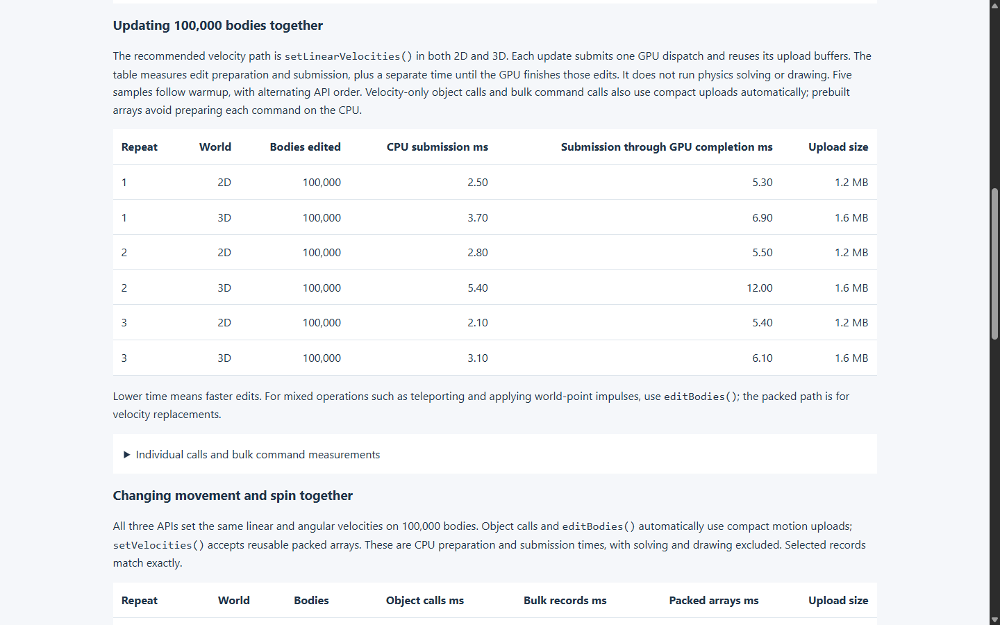](test-results/package-performance.html)

### Reading selected bodies and contacts

Rendering directly from `gpu.bodyBuffer` avoids pose downloads. Use the same
GPUDevice and the documented [direct rendering layout](#direct-gpu-rendering).
The full stride is 160 bytes in 3D and 96 bytes in 2D. `step()` automatically
flushes pending edits. Call `flushEdits()` before drawing if you want to show an
edit without taking a physics step.
Small repeated selections reuse readback storage. Concurrent requests use
separate staging buffers; returned arrays own their data. Idle storage is bounded
and released when the world is destroyed.

```js
// With any renderer: pass elapsed seconds, then draw its GPU buffers.
gpu.advance(elapsedSeconds, { maxSubSteps: 4 });
renderer.drawBodies(gpu.bodyBuffer, gpu.bodyCount);

// Only download the objects needed by CPU gameplay or a CPU-driven renderer.
const indices = [projectile.gpuIndex, sensor.gpuIndex];
const poses = await gpu.readSelectedBodies(indices, { posesOnly: true });
const projectileState = await projectile.readState();
```

`posesOnly` returns eight floats per 3D body (xyz/friction, quaternion) or four
per 2D body (xy, angle, friction). Full selected records contain 40 or 24 floats
respectively. These reads are explicit and asynchronous. Normal `step()` and
`advance()` do not download poses or wait for the GPU. A renderer with a Babylon
scene can instead use `gpu.attachToScene(scene)` for automatic stepping/disposal
in either dimension; native mesh synchronization remains renderer-owned.

```js
// Watch just gameplay-relevant pairs instead of every contact in a large pile.
gpu.watchContacts({ indices: [projectile.gpuIndex, sensor.gpuIndex] });
// After stepping, drain events when gameplay needs them:
const { events, dropped, full } = await gpu.readContactEvents();
for (const event of events) {
  if (event.type === "begin") {
    console.log(
      event.isTrigger ? "Entered trigger" : "Impact",
      event.a,
      event.b,
    );
  }
}
if (dropped || full) console.warn("Increase the contact event capacities");

// 3D query; 2D also offers raycast(), with xy vectors, and circleCast().
const hit = await gpu.sphereCast([0, 5, -10], 0.3, [0, 0, 1], {
  maxDistance: 30,
  includeTriggers: false,
});
if (hit) gpu.body(hit.index).applyImpulse([0, 0, 2], hit.point);
```

Event watching allocates GPU event storage and adds a contact pass when enabled.
Event reads transfer only the queued events. Queries see pending edits and return
numeric GPU indices. Reserve sufficient event capacity and drain events regularly.
Dispose the solver when finished; dispose the device only if your application
owns it.

## Joints, welds, springs, ropes and ragdolls

Babylon bodies can be connected directly. Anchors are expressed in the visible
mesh's local coordinates, including the centre/principal-frame conversion for
convex colliders. With a null first body, anchor A is a world position:

```js
// After creating aggregates a and b in the same world:
const ballJoint = physics.addJoint(null, a.body, {
  anchorA: [0, 6, 0],
  anchorB: [0, 0.5, 0],
});
const mortar = physics.addWeld(a.body, b.body, {
  anchorA: [0.5, 0, 0],
  anchorB: [-0.5, 0, 0],
  breakForce: 120,
  breakOnPull: true,
});
const spring = physics.addSpring(a.body, b.body, {
  stiffness: 100,
  rest: 1,
});
ballJoint.setWorldAnchor([1, 6, 0]);
const state = await mortar.readState(); // explicit, small GPU readback
console.log("Broken", state.broken);
spring.dispose(); // releases a reusable constraint slot
```

A weld captures the bodies' relative rotation on the GPU, including when added
to moving bodies. It does not force differently rotated meshes into matching
orientations. A spring without `rest` captures the current anchor separation.
`breakOnPull` adds linear force to the angular-force break test; it is not a
separate tensile-only material model. Joint changes and commands wake sleeping
bodies. Constraints can be created before initialization or during simulation.
Springs do not fracture; a finite `breakForce` on a Babylon spring is rejected.

For large scenes, the portable builders below avoid making one Babylon mesh per
collider. They are also exported by the package, require no custom shader loader,
and never step a CPU solver. The first portable example uses **z up** explicitly;
the rope, ragdoll and fabric helpers below use **y up**.

### Ball joints, welds and springs

Save as `demo/readme-constraints.js` in this repository. A ball joint holds two
anchor points together while allowing rotation. A weld also locks angular
movement; a finite fracture threshold makes it breakable. A spring pulls two
anchors toward a rest distance.

```js
// demo/readme-constraints.js
import { AvbdScene3D, createWebGPUDevice } from "avbd-babylon/native";

export async function createJointExamples() {
  const { device } = await createWebGPUDevice({
    requiredLimits: { maxStorageBuffersPerShaderStage: 9 },
  });
  const ref = new AvbdScene3D({
    timeStep: 1 / 60,
    iterations: 10,
    up: [0, 0, 1],
  });
  ref.addBox([30, 30, 1], {
    density: 0,
    friction: 0.7,
    position: [0, 0, -0.5],
  });
  const pendulum = ref.addBox([1, 1, 1], { position: [-6, 0, 5.5] });
  ref.addJoint(null, pendulum, [-6, 0, 6], [0, 0, 0.5]);
  pendulum.velocityLin.set([0, 2, 0]);

  const a = ref.addBox([1, 1, 1], { position: [-1, 0, 5] });
  const b = ref.addBox([1, 1, 1], { position: [0, 0, 5] });
  ref.addJoint(a, b, [0.5, 0, 0], [-0.5, 0, 0], {
    angularStiffness: Infinity,
    breakForce: 120,
  });

  const anchor = ref.addBox([0.5, 0.5, 0.5], {
    density: 0,
    position: [5, 0, 8],
  });
  const weight = ref.addBox([1, 1, 1], { position: [5, 0, 4] });
  ref.addSpring(anchor, weight, [0, 0, 0], [0, 0, 0], {
    stiffness: 100,
    rest: 4,
  });
  const gpu = ref.createSolver(device, {
    bodyCapacity: ref.bodies.length,
    minimumColors: 16,
    colorRounds: 32,
  });
  return { device, gpu, ref };
}
```

Joint anchors are local to their bodies; with `bodyA: null`, anchor A is a
world position. Linear/angular stiffness `Infinity` makes hard rows, `0`
disables them and finite values make compliant rows. The example's weld starts
with matching orientations, but differently rotated welds are supported too.
Fracture in this portable example is driven by angular constraint force. It is not
a universal linear-force break threshold.

Portable bodies accept **density** or an explicit **mass**; Babylon aggregates take **mass**.
Create native bodies and constraints before the GPU solver. Advance with
`gpu.step()`, inspect with `await gpu.readBodies()`, and release with
`gpu.destroy(); device.destroy()`. Use the native renderer for GPU drawing;
mesh synchronization is not supplied by this native example.

### Ropes and ragdolls

The portable builders provide actual linked-body ropes and ragdolls, not a
single soft mesh. Save this next helper as `demo/readme-rigs.js`:

```js
// demo/readme-rigs.js
import { AvbdScene3D, createWebGPUDevice } from "avbd-babylon/native";

export async function createNativeRig(kind = "rope") {
  const ref = new AvbdScene3D({ iterations: 10 }); // y up
  if (kind === "rope") {
    ref.addRope({ length: 12, segments: 12, endMass: 20 });
  } else if (kind === "ragdolls") {
    ref.addBox([20, 1, 20], { mass: 0, position: [0, -0.5, 0] });
    ref.addFabric({ columns: 12, rows: 12, spacing: 0.5, origin: [0, 2, 0] });
    for (const x of [-1, 1])
      for (const z of [-1, 1]) ref.addRagdoll({ origin: [x, 3, z] });
  } else {
    throw Error("Expected rope or ragdolls");
  }
  const { device } = await createWebGPUDevice({
    requiredLimits: { maxStorageBuffersPerShaderStage: 9 },
  });
  const gpu = ref.createSolver(device, {
    bodyCapacity: ref.bodies.length,
    minimumColors: 16,
    colorRounds: 32,
  });
  return { device, gpu, ref };
}
```

These helpers add to an `AvbdScene3D`. The rope is a chain with a static anchor
and an optional heavy end block. Each ragdoll has ten rigid parts and nine ball
joints, without anatomical limits or animation blending. `addFabric()` builds
a deformable mass-spring sheet with point-sampled collisions, stretch, shear
and bending links. Drawing triangles are provided in `indices`; collisions
do not test triangle interiors. The canonical rigid-net benchmark remains a
different workload from this fabric example.

For the complete rendered presets, open [Rope](index.html?demo=canonical&scene=3d-rope&backend=gpu),
[Heavy Rope](index.html?demo=canonical&scene=3d-heavy-rope&backend=gpu),
[Ragdolls on a rigid net](index.html?demo=canonical&scene=showcase-ragdolls-on-cloth-24k&backend=gpu),
[Breakable](index.html?demo=canonical&scene=3d-breakable&backend=gpu)
and [Castle siege](index.html?demo=cannon). The
[castle builder](demo/castleScene.js) shows connected mortar and roof joints.

### Tearable cloth

Play [Tearable cloth](index.html?demo=canonical&scene=3d-tearable-cloth&backend=gpu):
a 50 kg ball falls onto 1,024 points joined by elastic springs. Only the four
corners are pinned; the free edges sag and can fall after a tear. Springs stretch
and recover under gentle loads. Tear strength rises gradually from 35% tensile
extension at the center to 90% at the edges, with reinforced corner patches.
The impact tears the middle while the attachments hold. Compression does not tear the sheet. Collisions sample the
points; this does not provide continuous triangle collisions.

Here is the same physical construction using the published package. Save as
`demo/readme-tearable.js`; advance it with `gpu.step()` at 120 steps per
simulated second. At 60 display frames per second, use two steps per frame.

```js
// demo/readme-tearable.js
import { AvbdScene3D, createWebGPUDevice } from "avbd-babylon/native";

export async function createTearableCloth() {
  const ref = new AvbdScene3D({ timeStep: 1 / 120, iterations: 10 }); // y up
  ref.addBox([20, 1, 20], { mass: 0, position: [0, -0.5, 0] });
  const fabric = ref.addFabric({
    columns: 32,
    rows: 32,
    spacing: 0.25,
    origin: [0, 4, 0],
    mass: 0.02,
    stiffness: 1000,
    breakStrain: 0.35,
    // Coordinates are the spring midpoint in the original sheet, from 0 to 1.
    // Spread reinforcement across a patch so the first free row also holds.
    materialAt(u, v) {
      const edge = Math.max(Math.abs(2 * u - 1), Math.abs(2 * v - 1));
      const distance = Math.hypot(Math.min(u, 1 - u), Math.min(v, 1 - v));
      const t = Math.max(0, 1 - distance / 0.28);
      const reinforcement = t * t * (3 - 2 * t);
      return {
        stiffnessScale: 1 + 3 * reinforcement,
        breakStrain: 0.35 + 0.55 * edge ** 2 + 1.1 * reinforcement,
      };
    },
    bendingStiffness: 0,
    pinCorners: true,
  });
  const { grid, connections } = fabric;
  const ball = ref.addSphere(0.4, {
    mass: 50,
    position: [0.08, 7, 0.05],
    friction: 0.3,
  });
  const { device } = await createWebGPUDevice();
  const gpu = ref.createSolver(device, {
    bodyCapacity: ref.bodies.length,
    capacity: { contacts: 32000, pairs: 20000, manifolds: 8000, colors: 16 },
    minimumColors: 16,
    minimumColorRounds: 16,
  });
  return { ref, device, gpu, grid, connections, fabric, ball };
}
```

`materialAt(u, v)` runs once per spring while the sheet is built. It can return
`stiffnessScale`, `breakStrain` and `breakForce`; omitted fields keep the fabric
defaults. The GPU uses the resulting spring rows directly during simulation.

Each returned connection has a GPU `slot`. In `await gpu.readJoints()`, each
slot is 32 floats; a broken spring has zero stiffness at offset 3.
`fabric.triangleConnections` lists three indices into `fabric.connections`
for every triangle in `fabric.indices`. A tear must separate material instead
of deleting its faces. The web renderer partitions each face into three patches,
one per simulated point. Intact edges stretch together; broken edges keep each
point's share of the material, following its live pose. Detached patches remain
visible and physical indefinitely. There is no automatic debris lifetime.
This is a point-sampled cloth model, not an independent rigid-body shard model.
The web demo's [cloth renderer](demo/tearableClothRenderer.js) reads those
stiffness values on the GPU, so drawing does not download cloth poses or joint
states. Its [scene builder](demo/tearableClothScene.js) records which
connections support each triangle. The renderer is application code, excluded
from the package.

Thin objects can cross a surface between discrete collision checks. The
24K ragdoll net uses overlapping collision plates with exclusions for the eight
immediate neighbors. Other folds still collide, and the total sheet mass stays
the same. It uses five solver iterations and runs at 240 steps per simulated
second (four per 60 Hz frame). The smaller timestep costs more physics work; it is not continuous
collision detection. Benchmark times are per step and include the timestep in
the recorded settings.

With `broadphase: "auto"`, large scenes containing many linked thin plates use
HPLOC++ to find potential collisions. This includes the ragdoll net. It preserves
the same contact checks and solver settings; ordinary uniform block scenes use
the grid. Explicit `"grid"` and `"hploc"` settings remain available for your own
benchmarks. The choice uses body geometry and active constraint counts, so it
also applies to package scenes rather than depending on a demo name.

### Bounce, triggers, masks and sleeping

This complete scene shows three bounce strengths, a transparent trigger,
a ball that the trigger's mask ignores, and a box that cannot sleep.
Call `createMaterialExamples(scene)` after adding a Babylon camera and light.
With `autoAttach:true`, rendering the scene advances physics automatically.

```js
// src/materials-and-sensors.js
import { MeshBuilder, StandardMaterial, Color3 } from "@babylonjs/core";
import { AvbdPhysics, AvbdShapeType } from "avbd-babylon";

export async function createMaterialExamples(scene, onTrigger = console.log) {
  const physics = await AvbdPhysics.create({
    scene,
    autoAttach: true,
    capacity: 32,
    iterations: 10,
    sleeping: { speedThreshold: 0.03, timeThreshold: 0.5 },
  });
  const PLAYER = 1,
    WORLD = 2,
    SENSOR = 4,
    IGNORED = 8;
  const floorMesh = MeshBuilder.CreateBox(
    "floor",
    {
      width: 30,
      height: 1,
      depth: 12,
    },
    scene,
  );
  floorMesh.position.y = -0.5;
  const floor = physics.addAggregate(floorMesh, AvbdShapeType.BOX, {
    mass: 0,
    group: WORLD,
    collidesWith: PLAYER | IGNORED,
  });
  const balls = [0, 0.5, 0.9].map((restitution, i) => {
    const mesh = MeshBuilder.CreateSphere(
      `bounce-${restitution}`,
      { diameter: 1 },
      scene,
    );
    mesh.position.set(-6 + i * 3, 4, 0);
    const material = new StandardMaterial(`ball-${i}`, scene);
    material.diffuseColor = [
      new Color3(0.8, 0.3, 0.2),
      new Color3(0.2, 0.7, 0.4),
      new Color3(0.2, 0.5, 0.9),
    ][i];
    mesh.material = material;
    return physics.addAggregate(mesh, AvbdShapeType.SPHERE, {
      mass: 1,
      restitution,
      group: PLAYER,
      collidesWith: WORLD | SENSOR,
      allowSleep: true,
    });
  });
  const sensorMesh = MeshBuilder.CreateBox(
    "sensor",
    {
      width: 3,
      height: 4,
      depth: 4,
    },
    scene,
  );
  sensorMesh.position.set(5, 2, 0);
  const sensorMaterial = new StandardMaterial("sensor", scene);
  sensorMaterial.diffuseColor = new Color3(0.2, 0.8, 0.7);
  sensorMaterial.alpha = 0.2;
  sensorMesh.material = sensorMaterial;
  const sensor = physics.addAggregate(sensorMesh, AvbdShapeType.BOX, {
    mass: 0,
    isTrigger: true,
    group: SENSOR,
    collidesWith: PLAYER,
  });
  // This ball travels through the trigger; sensor entry/exit are reported.
  balls[2].body.setLinearVelocity([3, 0, 0]);
  const ignoredMesh = MeshBuilder.CreateSphere(
    "ignored",
    { diameter: 1 },
    scene,
  );
  ignoredMesh.position.set(2, 1, 1.5);
  const ignored = physics.addAggregate(ignoredMesh, AvbdShapeType.SPHERE, {
    mass: 1,
    group: IGNORED,
    collidesWith: WORLD | SENSOR,
  });
  ignored.body.setLinearVelocity([3, 0, 0]);
  // The sensor only accepts PLAYER, so IGNORED produces no overlap event.
  const awakeMesh = MeshBuilder.CreateBox("always-awake", { size: 1 }, scene);
  awakeMesh.position.set(-9, 0.5, 0);
  const alwaysAwake = physics.addAggregate(awakeMesh, AvbdShapeType.BOX, {
    mass: 1,
    allowSleep: false,
    group: PLAYER,
    collidesWith: WORLD,
  });
  const unsubscribe = physics.onContact((event) => {
    if (event.isTrigger) onTrigger(event);
  });
  return { physics, floor, balls, sensor, ignored, alwaysAwake, unsubscribe };
}
```

Live controls use these same returned handles:

```js
balls[1].body.setRestitution(0.8);
sensor.body.setTrigger(false); // becomes a solid wall
sensor.body.setTrigger(true); // becomes an overlap sensor again
ignored.body.setCollisionGroups(PLAYER, WORLD | SENSOR); // now detected
alwaysAwake.body.setSleepEnabled(true); // may sleep once supported and quiet
balls[0].body.setSleepEnabled(false); // wakes it and keeps it awake
```

Springs and welds have complete examples under [Joints, ropes and ragdolls](#joints-welds-springs-ropes-and-ragdolls)
and [Tearable cloth](#tearable-cloth). The [2D example](#2d-gpu-physics) covers
planar joints and motors; the following example covers 3D hinges and motors.

### 3D hinges, angle stops and motors

Save this as `src/hinge-motor.js`. The bar rotates around its pivot and stops at
the configured angles. Axes and anchors are in each body's local mesh frame;
angles are radians, speed is radians/second and maximum torque is N·m. Limits
refer to the relative orientation when the hinge is created.

```js
// src/hinge-motor.js
import { MeshBuilder } from "@babylonjs/core";
import { AvbdPhysics, AvbdShapeType } from "avbd-babylon";

export async function createHingeExample(scene) {
  const physics = await AvbdPhysics.create({
    scene,
    autoAttach: false,
    capacity: 8,
    iterations: 20,
  });
  const ground = MeshBuilder.CreateBox(
    "ground",
    { width: 12, height: 0.5, depth: 12 },
    scene,
  );
  ground.position.y = -0.25;
  physics.addAggregate(ground, AvbdShapeType.BOX, { mass: 0 });
  const pivot = MeshBuilder.CreateBox("pivot", { size: 0.3 }, scene);
  pivot.position.y = 3;
  const base = physics.addAggregate(pivot, AvbdShapeType.BOX, { mass: 0 });
  const bar = MeshBuilder.CreateBox(
    "bar",
    { width: 2, height: 0.3, depth: 0.3 },
    scene,
  );
  bar.position.y = 3;
  const rotor = physics.addAggregate(bar, AvbdShapeType.BOX, { mass: 1 });
  const hinge = physics.addHinge(base.body, rotor.body, {
    axisA: [0, 0, 1],
    axisB: [0, 0, 1],
    anchorA: [0, 0, 0],
    anchorB: [0, 0, 0],
    minAngle: -0.7,
    maxAngle: 0.7,
    motor: { speed: 1.5, maxTorque: 5 },
  });
  return { physics, hinge, rotor };
}
```

Call `physics.step()` in a fixed loop, or use `autoAttach:true` for automatic
Babylon stepping. Change direction with `hinge.motor.setMotor({speed:-1.5})`;
set `maxTorque:0` to turn its drive off. `hinge.dispose()` releases all of its
constraint rows. `physics.addMotor(a,b,options)` drives an angular axis without
locking the other axes; attach a hinge when only one rotation axis should move.

## Controlling bodies

Use `fallingBox`, `box` and `physics` from the complete example:

```js
import { Vector3, Quaternion } from "@babylonjs/core";

fallingBox.body.setLinearVelocity(new Vector3(0, 0, 5));
fallingBox.body.setAngularVelocity(new Vector3(0, 2, 0));
fallingBox.body.applyImpulse(new Vector3(3, 0, 0)); // through center of mass
fallingBox.body.applyImpulse(new Vector3(0, 2, 0), new Vector3(0.4, 1, 0)); // world-space point
fallingBox.body.applyAngularImpulse(new Vector3(0, 1, 0));
```

To restart a body after its previous commands have been stepped, reset its pose
and both velocities:

```js
fallingBox.body.teleport(new Vector3(0, 4, 0), Quaternion.Identity());
fallingBox.body.setLinearVelocity(Vector3.Zero());
fallingBox.body.setAngularVelocity(Vector3.Zero());
physics.setGravity(new Vector3(0, -9.81, 0));
```

Commands apply at the next step against live GPU mass, inertia and position.
Impulses queued for the same body are combined. Omitting the application point
applies an impulse through the center of mass. Teleport retains velocity unless
you also set it. To remove an object, dispose its aggregate and its mesh:

```js
fallingBox.dispose(); // removes collisions; does not dispose the visual mesh
box.dispose();
```

New aggregates can be added after initialization, within the reserved body
capacity. Body disposal does not reclaim that slot; reusable projectile bodies
avoid exhausting capacity. Constraint disposal does reclaim its slot.

## Queries, callbacks and sleeping

Raycasts query current GPU colliders, including pending body commands. They
return asynchronously and test boxes, spheres, exact capsules and convex hulls.
A query scans the bodies; use a few interactive queries rather than thousands
per frame in a half-million-body world. Batch methods named `raycastAll()` and
`sphereCastAll()` return one nearest hit per input query, not every hit along it.

```js
const hit = await physics.raycast([0, 5, -10], [0, 0, 1], {
  maxDistance: 30,
  ignore: [fallingBox.body],
});
if (hit) hit.body?.applyImpulse([0, 0, 5], hit.point);
const sweptBall = await physics.sphereCast([0, 5, -10], 0.4, [0, 0, 1], {
  maxDistance: 30,
  collidesWith: 0xffffffff,
  includeTriggers: false,
});
if (sweptBall) {
  console.log(
    sweptBall.distance,
    sweptBall.center,
    sweptBall.point,
    sweptBall.normal,
  );
}
const stopListening = physics.onContact((event) => {
  if (event.type === "begin")
    console.log("Impact", event.impulse, event.a, event.b);
});
// Later: stopListening();
```

Contact events contain body handles and a step number. Begin events also contain
a position, normal and normal impulse. Their GPU passes and asynchronous
readbacks are optional. `maxContactPairs` and `maxContactEvents` reserve event
storage. `readContactEvents()` reports `dropped` and `full`; automatic callbacks
also report exhausted storage in `physics.errors`. An event's `isTrigger` flag
distinguishes a non-solving overlap from a physical contact.

Use bounce, masks and trigger volumes through aggregate options:

```js
const PLAYER = 1,
  WORLD = 2,
  SENSOR = 4;
const ballPhysics = physics.addAggregate(ballMesh, AvbdShapeType.SPHERE, {
  mass: 1,
  restitution: 0.8,
  group: PLAYER,
  collidesWith: WORLD | SENSOR,
});
const sensorPhysics = physics.addAggregate(sensorMesh, AvbdShapeType.BOX, {
  mass: 0,
  isTrigger: true,
  group: SENSOR,
  collidesWith: PLAYER,
});
physics.onContact((event) => {
  if (event.isTrigger) console.log(event.type, event.a, event.b);
});
// Change settings without rebuilding the world:
ballPhysics.body.setRestitution(0); // disable bounce
sensorPhysics.body.setTrigger(false); // make it a solid collider
```

Both collision masks must permit a pair: `(a.group & b.collidesWith) !== 0`
and `(b.group & a.collidesWith) !== 0`. Masks also apply to trigger events.
Triggers use the same discrete collision shapes and contact margin as solid
contacts. Static–static pairs are not scanned; a static trigger detects dynamic
bodies. Bounce uses the larger coefficient of the pair. Impacts below 1 m/s
do not bounce, which prevents resting stacks from continually hopping.
The optional bounce solver uses normal impulses at the manifold centroid;
it is separate from AVBD's position solve and does not add collision friction.

Enable sleeping at world creation to let supported resting bodies stop solving:

```js
// Use this option when creating the world in the complete example:
const physics = await AvbdPhysics.create({
  scene,
  sleeping: { speedThreshold: 0.03, timeThreshold: 0.5 },
});
// After adding bodies:
fallingBox.body.setSleepEnabled(true); // eligible; also enables the world policy
alwaysMovingBox.body.setSleepEnabled(false); // this body always stays awake
fallingBox.body.wakeUp();
console.log(await physics.readSleepStats());
```

Impulses, teleports, constraint edits, new bodies and removed supports wake the
world. Impacts and moving joint endpoints also wake it conservatively. Under
gravity, unsupported slow-moving bodies stay awake; supports extend upward
through resting contacts. This does not guarantee that every suspended or
jointed object will sleep. Sleeping is off by default unless a body explicitly
opts in with `allowSleep:true` or `setSleepEnabled(true)`. Enabling it on the
world makes bodies eligible by default; `allowSleep:false` excludes a body.
Paper comparisons keep sleeping disabled. Portable 3D solvers accept these
same world and initial-body options.

The [browser performance page](tests/performance.html) has a separate sleeping
benchmark, including the cost of sleep checks while bodies are awake. It reports
the number of boxes asleep and the difference in their final positions. See
[saved results from an RTX 4070 Laptop GPU](test-results/package-performance.html).
`body.readState()` reports physical `mass`, solver `effectiveMass` (zero while
asleep), and a `sleeping` flag.

## 2D GPU physics

The 2D API includes boxes, circles, capsules, finite lines and infinite planes,
plus restitution, masks, non-solving triggers, raycasts and circle casts. It
uses numeric body indices. This complete factory creates a bouncing circle,
a trigger, a powered planar hinge and a welded pair:

```js
// demo/readme-2d.js
import { AvbdScene2D, createWebGPUDevice } from "avbd-babylon/native";

export async function create2DExamples() {
  const { device } = await createWebGPUDevice();
  const scene2D = new AvbdScene2D({ iterations: 20 });
  scene2D.addPlane([0, 1], 0, { group: 2 });
  const ball = scene2D.addCircle(0.25, {
    position: [-2, 5],
    velocity: [1.5, 0, 0],
    restitution: 0.75,
    group: 1,
    collidesWith: 2 | 4,
  });
  const trigger = scene2D.addBox([1, 3], {
    density: 0,
    position: [0, 2],
    isTrigger: true,
    group: 4,
    collidesWith: 1,
  });
  const wheel = scene2D.addCircle(0.5, { position: [3, 3] });
  scene2D.addJoint(-1, wheel, [3, 3], [0, 0], {
    stiffness: [Infinity, Infinity, 0], // free angular row: planar hinge
  });
  const motor = scene2D.addMotor(-1, wheel, { speed: 2, maxTorque: 10 });
  const attached = scene2D.addBox([1, 1], { position: [4, 3] });
  scene2D.addJoint(wheel, attached, [0.5, 0], [-0.5, 0], {
    stiffness: [Infinity, Infinity, Infinity], // lock all three rows: weld
    breakForce: 1000,
  });
  const gpu = scene2D.createSolver(device, { bodyCapacity: 8 });
  gpu.watchContacts({ indices: [ball, trigger] }); // only pairs touching these bodies report events
  return { scene2D, device, gpu, ball, trigger, wheel, attached, motor };
}
```

Use the returned `gpu` in a fixed loop. Query current poses asynchronously:

2D joints, springs and motors return handles with `slot`, `dispose()` and
`destroy()`. Disposal is safe before initialization, during simulation or after
solver destruction. For a motor, call `gpu.setMotor(motor.slot, { speed: -2,
maxTorque: 10 })` to change its drive without rebuilding the world. Zero torque
leaves free rotation. In 2D, speed is angular velocity of body A minus body B;
with world body A (`-1`), positive speed drives B clockwise. To inspect fracture,
use the live GPU joint records; handle `disposed` describes manual removal.

```js
const ray = await gpu.raycast([-5, 2], [1, 0], { maxDistance: 10 });
const circle = await gpu.circleCast([-5, 2], 0.4, [1, 0], {
  maxDistance: 10,
  includeTriggers: false,
  collidesWith: 2,
});
gpu.step();
const { events, dropped } = await gpu.readContactEvents();
for (const event of events)
  console.log(event.type, event.a, event.b, event.isTrigger);
if (dropped) console.warn("Increase maxEvents in watchContacts()");
gpu.setRestitution(ball, 0.5);
gpu.setFilters([ball], [1], [2]); // exclude the trigger on subsequent steps
gpu.setSensor(trigger, false); // becomes a solid collider
```

`raycastAll()` and `circleCastAll()` batch multiple queries. Cast results include
the body `index`, distance travelled by the query center, surface normal,
query `center` and contact `point` on the target. A cast starting overlapped
returns distance zero and a normal opposite the query direction; it does not
calculate a penetration depth or a unique target surface point. Queries do not turn on continuous collision
detection in the simulation. Release `gpu` and `device` when done.

Circles and capsules use analytic curved contacts and their exact area mass
and inertia. They collide with each other, boxes, convex polygons, segments and planes, and work
with joints, friction, bounce, triggers and casts. Capsules lie along local X;
`length` includes both caps. Rotate them with `angle` in radians.

```js
// demo/readme-2d-shapes.js
import { AvbdScene2D, createWebGPUDevice } from "avbd-babylon/native";

export async function create2DShapeExamples() {
  const { device } = await createWebGPUDevice();
  const scene2D = new AvbdScene2D({ gravity: -10, timeStep: 1 / 120 });
  scene2D.addPlane([0, 1]); // an infinite floor at y = 0
  scene2D.addPlane([1, 0], -8); // left wall; allowed side is x >= -8
  scene2D.addPlane([-1, 0], -8); // right wall; allowed side is x <= 8
  scene2D.addSegment([-7, 4], [-1, 2]); // finite, two-sided, zero thickness
  scene2D.addSegment([1, 2], [7, 4], { radius: 0.15 }); // rounded static rail

  const ball = scene2D.addCircle(0.5, { position: [-3, 6], restitution: 0.5 });
  const capsule = scene2D.addCapsule(0.3, 2, {
    position: [3, 6],
    angle: Math.PI / 4,
    velocity: [0, 0, 1],
  });
  const polygon = scene2D.addHull(
    [
      [-0.8, -0.4],
      [0.5, -0.5],
      [0.8, 0.2],
      [0, 0.8],
      [-0.6, 0.4],
    ],
    { position: [0, 6], density: 2, restitution: 0.2 },
  );
  const gpu = scene2D.createSolver(device, { bodyCapacity: 256 });

  gpu.setLinearVelocity(ball, [2, 0]).setAngularVelocity(ball, -4);
  gpu.applyImpulse(capsule, [0, 2]); // at the center of mass
  const current = await gpu.readBodyState(capsule);
  gpu.applyImpulse(
    capsule,
    [0, 2],
    [current.position[0] + 0.5, current.position[1]],
  );
  gpu.applyForce(ball, [10, 0]); // one fixed step; repeat each step for a continuous force
  gpu.applyAngularImpulse(capsule, 0.5); // scalar angular impulse in 2D
  gpu.applyTorque(capsule, 2); // one fixed step
  gpu
    .teleport(ball, [-3, 6], 0)
    .setLinearVelocity(ball, [0, 0])
    .setAngularVelocity(ball, 0);

  // Spawn after initialization, within the reserved body capacity.
  const spawned = gpu.addCapsule(0.25, 1.5, { position: [0, 8] });
  const spawnedHull = gpu.addHull([-0.6, -0.4, 0.6, -0.4, 0, 0.8], {
    position: [4, 8],
    angle: 0.3,
  });
  gpu.step();
  return { scene2D, device, gpu, ball, capsule, polygon, spawned, spawnedHull };
}
```

Commands execute in order for each body and use its current GPU mass, inertia
and position. `teleport()` preserves velocity and, if omitted, the current
angle. Queries and state reads include pending commands. `readBodyState()`
downloads one body, so it is suitable for inspection; drawing many bodies should
read `gpu.bodyBuffer` directly. Vector commands also accept Babylon `Vector2`.

`addSegment(start,end)` takes world-space endpoints and is static by default.
A dynamic segment requires a positive `radius` and `density`; it is then a
capsule. Zero-thickness lines remain static. Lines are two-sided and have finite
endpoints. A plane is static and infinite: its normalized normal points toward
the allowed side, `dot(normal, point) >= offset`. It is a solid half-space,
not a thin infinite line. A zero-density circle or capsule is also static.

`addHull(points, options)` accepts flat xy pairs (including typed arrays) or an
array of `[x,y]` pairs. It removes duplicate and interior points and constructs
a convex boundary of 3–32 vertices. Concavities become filled. Collinear clouds
and hulls with more than 32 boundary vertices are rejected. The polygon is
centered on its area centroid: `position` is its center of mass, and `angle`
rotates it around that center. Mass and angular inertia come from its exact area,
not its bounding box. GPU contacts clip polygon edges; raycasts and circle casts
test the actual edges and rounded corners. Static hulls use `density:0`.

Try [Mixed 2D colliders](index.html?demo=canonical&scene=2d-mixed-shapes&backend=gpu).
The same scene appears in the all-scene browser benchmark. Box-only worlds
use the box collision kernels and allocate no extra shape buffer.

For a Babylon project, attach the native 2D solver to your existing scene:

```js
const gpu = scene2D.createSolver(device, { bodyCapacity: 256 });
gpu.attachToScene(scene); // fixed steps before rendering; destroys gpu when scene is disposed
// Optional: gpu.detachFromScene() to take over stepping yourself.
```

The default loop uses the configured timestep, allows at most six catch-up steps
per render frame and caps elapsed frame time at 50 ms. Pass
`{ maxSubSteps: 4, maxFrameTime: 0.04, afterStep: (gpu) => {} }` to customize it.
Attaching twice to the same scene keeps one loop. Detach before attaching to
another scene, and do not call `gpu.step()` separately while attached. This
handles simulation timing and solver cleanup; you still choose how to draw 2D
bodies. The shared GPUDevice remains yours to dispose.

Coordinates are x/y, with gravity along y. A joint with free angular stiffness
acts as a hinge; motors drive relative angular speed.

```js
import { AvbdScene2D, createWebGPUDevice } from "avbd-babylon/native";

const { device } = await createWebGPUDevice();
const scene2D = new AvbdScene2D({ gravity: -10, iterations: 10 });
scene2D.addBox([120, 1], { density: 0, position: [0, -0.5] });
for (let i = 0; i < 10_000; i++) {
  scene2D.addBox([1, 1], {
    position: [(i % 100) - 49.5, Math.floor(i / 100) + 0.5],
  });
}
const gpu = scene2D.createSolver(device, { bodyCapacity: 10_001 });
gpu.step();
const counters = await gpu.readCounters(); // explicit inspection
gpu.adapt(counters);
// 24 floats per GPU body: x, y and angle at offsets 0, 1 and 2.
// Draw gpu.bodyBuffer directly, or mirror a small scene with readBodies().
gpu.destroy();
device.destroy();
```

On a fresh builder, a hinged wheel and a motor use:

```js
const wheel = scene2D.addBox([1, 1], { position: [0, 3] });
scene2D.addJoint(-1, wheel, [0, 3], [0, 0], {
  stiffness: [Infinity, Infinity, 0],
});
scene2D.addMotor(-1, wheel, { speed: 2, maxTorque: 10 });
```

Create 2D constraints before `createSolver()`. For stress tests, inspect overflow/clash counters and
adapt: incomplete contact data must not be treated as a valid result.

The default 2D settings use the upstream GPU configuration: `alpha: 0.95`,
nearest-contact matching and no extra position-correction pass. The original
[AVBD 2D reference](https://github.com/savant117/avbd-demo2d) runs on the CPU
and defaults to `alpha: 0.99` plus a final correction pass. For an explicit
comparison, construct `AvbdScene2D({ alpha: 0.99, postStabilize: true,
matchNearest: false })`. This changes solver settings, not the execution
backend; the package still steps on the GPU. Neither option changes the core
AVBD method.

## 2D sleeping and hinge stops

2D uses the same portable builder, with body indices rather than mesh handles.
Enable sleeping on the solver, or opt in with a body's `allowSleep: true`.
`allowSleep: false` keeps that body awake. Sleeping is off by default.

```js
// demo/readme-2d-policies.js
import { AvbdScene2D, createWebGPUDevice } from "avbd-babylon/native";

export async function create2DPolicyExamples() {
  const { device } = await createWebGPUDevice();
  const scene = new AvbdScene2D({ timeStep: 1 / 120, iterations: 10 });
  scene.addPlane();
  const stack = [];
  for (let y = 0; y < 4; y++) {
    for (let x = 0; x < 16; x++) {
      stack.push(scene.addBox([1, 1], { position: [x * 1.02, y + 0.5] }));
    }
  }
  const arm = scene.addCapsule(0.2, 2, {
    position: [20, 3],
    allowSleep: false,
  });
  const hinge = scene.addHinge(-1, arm, [20, 3], [0, 0], {
    minAngle: -Math.PI / 4,
    maxAngle: Math.PI / 4,
    motor: { speed: 2, maxTorque: 10 },
  });
  const gpu = scene.createSolver(device, {
    sleeping: { speedThreshold: 0.03, timeThreshold: 0.3 },
  });
  return { scene, device, gpu, stack, arm, hinge };
}
```

After creating this example, use live controls:

```js
const example = await create2DPolicyExamples();
const { gpu, stack, hinge } = example;
gpu.setMotor(hinge.motor.slot, { speed: -2, maxTorque: 5 });
hinge.limits.setLimits({ minAngle: -0.2, maxAngle: 0.6 });
gpu.setSleepEnabled(stack[0], false);
gpu.applyImpulse(stack[1], [1, 0]); // also wakes sleeping bodies
gpu.step();
console.log(await gpu.readSleepStats());
console.log((await gpu.readBodyState(stack[1])).sleeping);
// gpu.attachToScene(babylonScene) can own timing and disposal.
// A manual loop uses gpu.step() at the configured fixed timestep.
hinge.dispose();
gpu.destroy();
example.device.destroy();
```

In 2D, motor speed and limit angles use A-minus-B rotation. Positive speed
rotates body B clockwise when A is the world. Bounds are in radians relative
to the starting relative angle. They can span more than one turn; there is no
implicit wrap at ±π. A hinge with no bounds rotates freely. Equal bounds lock
its relative angle. `addAngularLimit(a,b,{minAngle,maxAngle})` adds angle stops
without connecting positions. Disposing a hinge releases its joint, stops and
motor together; its individual handles can also be disposed separately.

Sleeping retains each body's mass and inertia, and keeps collision detection
active. Under gravity, quiet supports establish a path from static ground or a
world anchor through the pile. Unsupported slow falls stay awake. A powered
motor stays awake even when pressing against a stop. Waking is conservative:
an impact or edit can wake the whole world, so savings are largest after settling.
`gpu.enableSleeping(options)` also updates thresholds; `disableSleeping()`
wakes every body and removes the policy's buffers. These policies need no pose
readbacks while stepping. A custom 2D renderer can inspect the sleeping flag in
`velocity.w` (float 15 of each 24-float body); mass and inertia remain floats 22/23.

Try the `2d-sleeping-pile` and `2d-limited-hinges` scenes in the browser.
The native GPU API benchmark measures sleeping in both dimensions, includes all sleep
checks, and shows the cost while every body is awake as well as after settling.

## Slingshot siege demo

After `npm start`, open [Slingshot siege](index.html?demo=slingshot).
Pull the red ball back and release; Space fires, Next ball reloads and Rebuild
restores the forts. Choose 1,000, 5,000 or 10,000 bricks. Target counts and bricks
moved show the impact; the collapsible display shows frame rate, contacts,
sleeping bodies and drawing time. Toggle Sleeping to compare the same scene.
Scroll to zoom; Shift-drag pans the view. Boost gives each launched ball one
extra impulse and a short thrust. The fixed timestep is 1/120 second with ten
solver rounds; the meter shows the actual physics rate alongside frame rate.

The level uses every supported category of 2D physics:

| Feature                                                     | Where to see it                                                                                                                               |
| ----------------------------------------------------------- | --------------------------------------------------------------------------------------------------------------------------------------------- |
| Boxes, circles, capsules, convex hulls, segments and planes | Bricks, balls, chain links, roof tiles, launcher and ground                                                                                   |
| Joints, world anchors and ropes                             | Hanging targets and linked ragdoll limbs                                                                                                      |
| Welds and fracture                                          | Small masonry panels and roof tiles use locked joints with a break force; impacts break the mortar                                            |
| Springs                                                     | Elastic platforms under the small ragdolls                                                                                                    |
| Limited hinges and motors                                   | Powered blue gates reverse at their angle stops; toggle Powered gates                                                                         |
| Friction and restitution                                    | Bricks grip their supports; Bouncy ball changes the projectile's bounce                                                                       |
| Masks, overlap sensors and contact events                   | The pale scoring arch reports ball crossings without blocking the ball; the held ball cannot collide                                          |
| Raycasts and circle casts                                   | Drag and hold to aim; the red ring predicts the ball's first obstacle, allowing for its radius; the small cross marks the straight center ray |
| Sleeping, waking and live edits                             | Toggle Sleeping; fire, reload or boost to wake and move bodies                                                                                |
| Velocity, force, torque and impulses                        | Launch sets velocity; Boost adds an impulse and a short thrust with spin                                                                      |

The renderer draws the GPU body buffer directly. Periodic diagnostic copies count
moved bricks, update gate controls and show broken supports; drawing does not
download poses. Aiming queries run only while aiming. Predictions sample the
current scene and do not provide continuous collision detection.
The source is in `demo/slingshotScene2D.js` (level construction) and
`demo/slingshotDemo.js` (GPU controls, events and queries).
Its `2d-slingshot-siege` scene is also in the all-scene benchmark,
which keeps sleeping off for consistent solver measurements.

## Manual stepping and cleanup

For a custom fixed-step schedule, use this instead of automatic world creation.
Here `scene` has no AVBD world yet and `floor` is a Babylon mesh; add all other
aggregates before initialization:

```js
import { AvbdPhysics, AvbdShapeType } from "avbd-babylon";

const physics = await AvbdPhysics.create({
  scene,
  autoAttach: false,
  syncMeshes: false,
  timeStep: 1 / 60,
});
physics.addAggregate(floor, AvbdShapeType.BOX, { mass: 0 });
physics.initialize();
for (let step = 0; step < 120; step++) physics.step(); // two simulated seconds
await physics.syncMeshes(); // explicit inspection rather than a per-frame wait
const poses = await physics.readBodies();
console.log(
  "Steps",
  physics.steps,
  "Finite data",
  poses.every(Number.isFinite),
);
physics.dispose();
```

`step()` submits one fixed step without waiting for GPU completion. Readbacks
wait for the submitted data they inspect. Manually managed worlds must be
explicitly disposed. A world-created device is destroyed with the world;
an explicitly supplied device stays owned by the caller.

## Worker integration

Keep Babylon and AVBD together in a module worker. Transfer an OffscreenCanvas
once and send small input/resize messages from the page. Save the brick-wall
helper alongside the worker. This uses Babylon WebGL drawing and AVBD WebGPU
physics; there is no separate AVBD solver implementation to select.

```js
// src/worker-main.js — use instead of src/main.js
const canvas = document.getElementById("canvas");
const worker = new Worker(new URL("./render-worker.js", import.meta.url), {
  type: "module",
});
const dimensions = () => ({
  width: Math.max(1, canvas.clientWidth),
  height: Math.max(1, canvas.clientHeight),
});
const offscreen = canvas.transferControlToOffscreen();
worker.postMessage({ type: "init", canvas: offscreen, ...dimensions() }, [
  offscreen,
]);
window.addEventListener("resize", () =>
  worker.postMessage({ type: "resize", ...dimensions() }),
);
window.addEventListener("keydown", (event) => {
  if (event.code === "Space") {
    event.preventDefault();
    worker.postMessage({ type: "shoot" });
  }
});
worker.addEventListener("message", ({ data }) => {
  if (data.type === "error") console.error(data.message);
});
window.addEventListener("pagehide", () => worker.terminate(), { once: true });
```

```js
// src/render-worker.js
import {
  Engine,
  Scene,
  FreeCamera,
  HemisphericLight,
  Vector3,
} from "@babylonjs/core";
import { createBrickWallScene } from "./brick-wall.js";

let engine, scene, physics, shoot;
self.onmessage = async ({ data }) => {
  try {
    if (data.type === "init") {
      data.canvas.width = data.width;
      data.canvas.height = data.height;
      engine = new Engine(data.canvas, true);
      scene = new Scene(engine);
      const camera = new FreeCamera("camera", new Vector3(0, 5, -16), scene);
      camera.setTarget(new Vector3(0, 2, 0));
      new HemisphericLight("light", new Vector3(0, 1, 0), scene);
      ({ physics, shoot } = await createBrickWallScene(scene));
      engine.runRenderLoop(() => scene.render());
      self.postMessage({ type: "ready" });
    } else if (data.type === "resize" && engine) {
      engine.setSize(data.width, data.height);
    } else if (data.type === "shoot" && shoot) {
      shoot();
    }
  } catch (error) {
    self.postMessage({ type: "error", message: error.message });
  }
};
```

Camera controls that use DOM events need similar forwarding. Workers keep
setup and submission off the UI thread; they do not accelerate GPU kernels.
For large scenes, keep direct GPU rendering in that worker instead of copying
every pose back to the page.

## Benchmark replication

Start this repository with `npm start`. Play scenes while the benchmark is
idle; drawing and sleeping stop during solver-only measurements.
Check the GPU shown in the results before comparing timings. On computers with
two GPUs, a browser can choose the integrated GPU even when high performance is
requested. The repository's isolated Chromium checks request its high-performance
GPU and saved results record the adapter that actually ran each benchmark.

| Demo                                                                                                   | What it exercises                                                            |
| ------------------------------------------------------------------------------------------------------ | ---------------------------------------------------------------------------- |
| [Mixed gallery](index.html?demo=showcase)                                                              | All five collider types, rotation and floor contacts.                        |
| [Castle siege](index.html?demo=cannon)                                                                 | Mortar, walls, towers, roofs and local fracture.                             |
| [100K rook impact](index.html?demo=gpu-stress)                                                         | Local projectile damage and direct GPU drawing.                              |
| [28K brick ring](index.html?demo=canonical&scene=showcase-brick-ring-28k&backend=gpu)                  | A projectile striking a circular wall.                                       |
| [100K columns](index.html?demo=canonical&scene=showcase-box-columns-100k&backend=gpu)                  | Sparse contacts and shared contact-point work.                               |
| [2D hinges and motors](index.html?demo=canonical&scene=2d-limited-hinges&backend=gpu)                  | Angle stops, reverse drive and braking.                                      |
| [3D hinges and motors](index.html?demo=canonical&scene=3d-limited-hinges&backend=gpu)                  | Axis alignment, angle stops, reverse drive and braking.                      |
| [2D triggers and masks](index.html?demo=canonical&scene=2d-triggers-and-masks&backend=gpu)             | Non-solving overlaps, mutual masks, live filter edits, ray and circle casts. |
| [3D triggers and masks](index.html?demo=canonical&scene=3d-triggers-and-masks&backend=gpu)             | Non-solving overlaps, mutual masks, live filter edits, ray and sphere casts. |
| [Tearable fabric](index.html?demo=canonical&scene=3d-tearable-cloth&backend=gpu)                       | Elastic stretching, reinforced corner supports and persistent fragments.     |
| [Rigid net and ragdolls](index.html?demo=canonical&scene=showcase-ragdolls-on-cloth-24k&backend=gpu)   | Connected rigid parts and a plate net.                                       |
| [Fabric and blocks](index.html?demo=canonical&scene=paper-cloth-35k&backend=gpu)                       | Deformable fabric, joints and rigid/fabric contacts.                         |
| [Half-million walls](index.html?demo=canonical&scene=paper-walls-510k-4&backend=gpu&quality=benchmark) | Dense contacts and four AVBD iterations.                                     |
| [100K 2D pile](index.html?demo=canonical&scene=2d-stress-pile-100k&backend=gpu)                        | Dense 2D contacts and ten iterations.                                        |
| [D20 particles](index.html?demo=benchmark)                                                             | Collision timing and particle sprites; not an AVBD rigid-body benchmark.     |

Open [the browser benchmark](tests/performance.html), choose
60 warmup steps, 60 samples and three repeats, with Automatic collision selection.
For scripted replication, run this in that page's developer console:

```js
// On /tests/performance.html after the page is ready.
// These globals are repository test helpers, not the npm API.
await __BENCHMARK_VIEW__.suspendPreview();
try {
  const results = [];
  for (const scene of [
    "3d-sphere-contacts",
    "3d-convex-hulls",
    "3d-rope",
    "3d-breakable",
    "showcase-ragdolls-on-cloth-24k",
    "showcase-box-columns-100k",
    "showcase-brick-ring-110k",
    "paper-walls-510k-4",
    "2d-stress-pile-100k",
  ]) {
    for (let repeat = 0; repeat < 3; repeat++) {
      results.push({
        ...(await __PERFORMANCE__.run(scene, "production", 60, 60)),
        repeat,
      });
    }
  }
  console.table(
    results.map((r) => ({
      scene: r.scene,
      objects: r.bodyCount,
      contacts: r.peakContacts,
      iterations: r.params.iterations,
      collisionMs: r.summary.collision.mean,
      movementMs: r.summary.solve.mean,
      physicsMs: r.summary.total.mean,
      slowerStepsMs: r.summary.total.p95,
      cpuSubmissionMs: r.summary.submission.mean,
    })),
  );
  console.log({ adapter: __PERFORMANCE__.info, results });
} finally {
  await __BENCHMARK_VIEW__.preview.load(document.getElementById("scene").value);
}
```

Each run starts fresh and checks contact storage, parallel-work conflicts and
finite poses. GPU stages measure finding contacts, preparing them, planning
parallel work and moving objects. CPU submission and startup have separate
fields; wall time also includes waiting for measurements. These are physics
timings, not rendered FPS. The [integration guide](docs/README.md#reproduce-the-collision-and-solver-benchmarks)
includes downloads and profiling commands.

Saved reports were recorded on an **NVIDIA GeForce RTX 4070 Laptop GPU**. Live
runs measure your GPU. The paper's desktop RTX 4090 numbers use different
hardware and reconstructed workloads; they are a separate comparison.
Keep other GPU workloads closed when measuring. Enhanced lighting and AA are
for playing; use `quality=benchmark` for rendering comparisons.

## Babylon renderer comparison

Every canonical 2D and 3D scene, plus the slingshot game, has a **Renderer**
selector. Choose **Babylon WebGPU** to play with Babylon drawing the scene;
switching renderers restarts it. Direct WebGPU is the default. The benchmark
page's playground has the same choice.

Try [100K boxes in Babylon](index.html?demo=canonical&scene=showcase-box-columns-100k&backend=gpu&renderer=babylon),
[tearable cloth](index.html?demo=canonical&scene=3d-tearable-cloth&backend=gpu&renderer=babylon)
or [the slingshot game](index.html?demo=slingshot&renderer=babylon).

Babylon uses thin instances for shared shapes and merges unique hull geometry
for the castle and fractured pieces. Materials and world matrices are frozen;
CPU bounds updates and mesh picking are disabled. Body poses stay on the GPU:
AVBD and Babylon use the same device, and GPU copies supply Babylon-owned
storage buffers to the vertex shaders. Instance matrices are uploaded once.
Colors are copied again only when edited. Camera controls, contact overlays,
shape sizes and cloth tearing use the viewer's existing geometry and shaders.

The [Babylon renderer source](demo/babylonGpuRenderer.js) and
[WGSL adapter](demo/babylonShaders.js) show the integration. This is a custom
Babylon shader renderer; ordinary Babylon materials use the matrix-update path
shown in [Large pile with thin instances](#large-pile-with-thin-instances).
The demo isolates its access to Babylon 9's internal `_device` field in
`createBabylonEngine()`. The npm package remains independent of this demo code
and has no Babylon runtime dependency.

Open [the renderer benchmark](tests/performance.html#renderer-comparison) to
compare either the selected scene or every scene. It advances physics once,
then draws that same state with both renderers, alternating which draws first.
Both use the same device, camera, geometry and shaders at 960 × 540 pixels,
with antialiasing and debug overlays off. The preview stops during measurement.
An all-scene run keeps one engine/device and creates a fresh physics world for
each scene and repeat. Each scene combines the measured draws across repeats;
individual runs remain available in its details.
Blue bars show GPU drawing; orange shows Babylon's GPU buffer copies. CPU
submission and the wait for GPU completion are separate measurements. These
numbers describe rendering cost, rather than displayed FPS or paper results.

```js
// Repository benchmark helper, on /tests/performance.html.
await __BENCHMARK_VIEW__.suspendPreview();
try {
  const result = await __PERFORMANCE__.runRenderers(
    "showcase-box-columns-100k",
    { warmup: 20, samples: 30 },
  );
  console.table({
    directWebGPU: result.webgpu,
    babylonWebGPU: result.babylon,
  });
} finally {
  await __BENCHMARK_VIEW__.preview.load(
    document.getElementById("scene").value,
  );
}
```

Run `npm run test:renderers` for scene and benchmark checks, or
`npm run benchmark:renderers` to refresh the three-repeat comparison of small,
medium and large workloads. Add `-- --all` to benchmark every canonical scene.
The [saved comparison](test-results/renderer-performance.html) identifies its
RTX 4070 Laptop GPU and links the raw measurements and every scene screenshot.

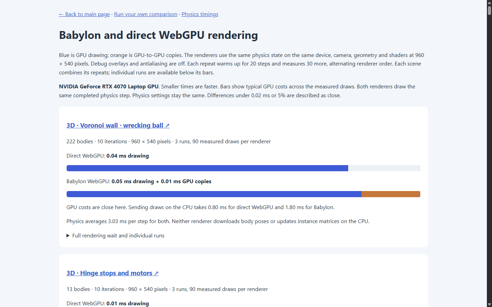

| Babylon: 2D shapes | Babylon: torn fabric |
| --- | --- |
| 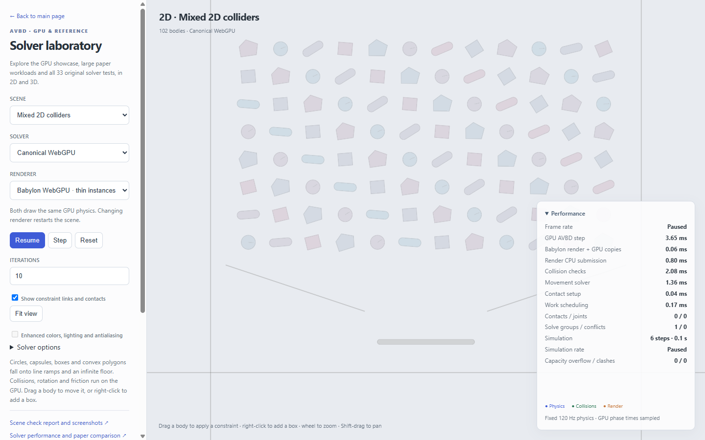 | 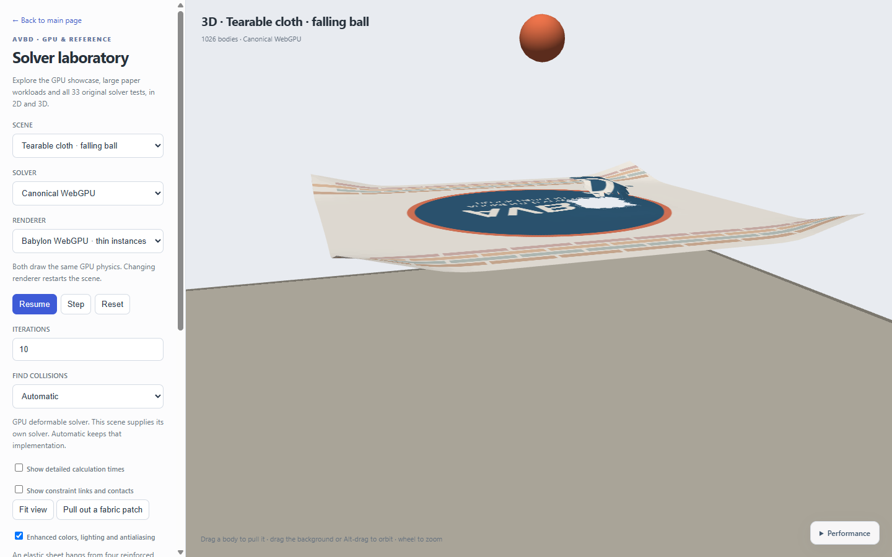 |
| Babylon: ragdolls on a net | Babylon: 100K columns |
| 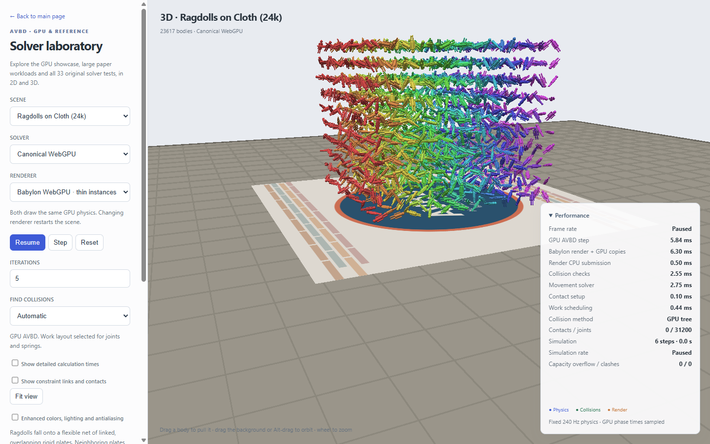 | 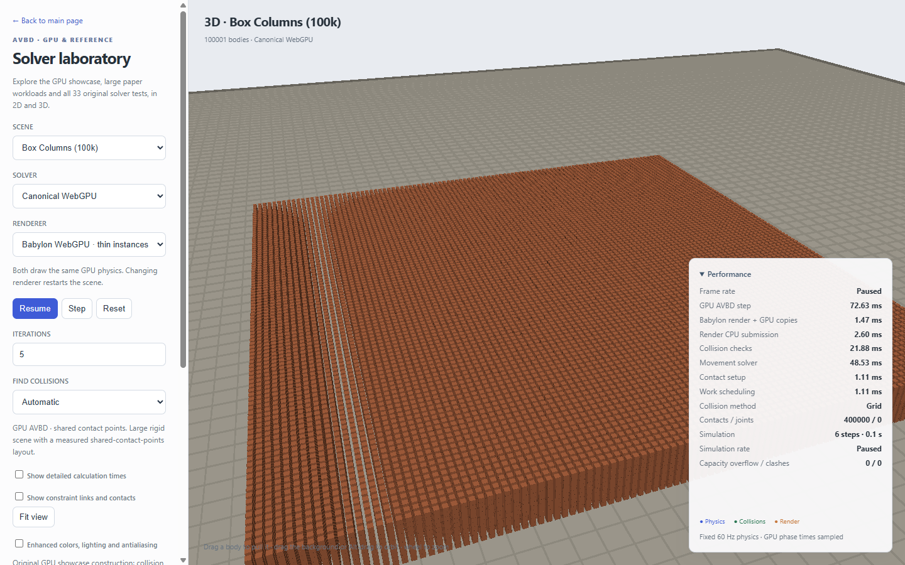 |

See the [live comparison controls](test-results/screenshots/renderer-live-comparison.png),
[mobile comparison layout](test-results/screenshots/renderer-comparison-390.png),
and [mobile Babylon viewer](test-results/screenshots/babylon-cloth-mobile.png).

## Script-tag usage

Run `npm run build:cdn` and serve `dist/avbd.global.js` from your site. It assigns
`globalThis.AVBD` and works with an existing Babylon global:

```html
<script src="./vendor/babylon.js"></script>
<script src="./vendor/avbd.global.js"></script>
<script type="module">
  const { AvbdPhysics, AvbdPhysicsAggregate, AvbdShapeType } = AVBD;
  // scene, floor and box belong to your existing Babylon setup.
  const physics = await AvbdPhysics.create({ scene });
  new AvbdPhysicsAggregate(floor, AvbdShapeType.BOX, { mass: 0 }, scene);
  new AvbdPhysicsAggregate(box, AvbdShapeType.BOX, { mass: 2 }, scene);
  // Start rendering after adding every aggregate.
</script>
```

ESM and global builds expose the same API. The package's `unpkg` and `jsdelivr`
entries select its global build for CDN use when published.

## Build and run the repository

```sh
npm install
npm run build          # ESM library only: dist/avbd.js
npm run build:cdn      # Browser global: dist/avbd.global.js
npm run build:web      # Website and browser benchmarks
npm run build:all      # All three outputs
npm start              # Build library, watch and serve website
npm pack               # Build and create an installable library archive
```

Release, website and GPU-test builds omit source maps by default. They are
debugging files, not runtime dependencies, and can be much larger than the
JavaScript. To generate them locally:

```sh
npm run build -- --sourcemap
npm run build:cdn -- --sourcemap
npm run build:web -- --sourcemap
npm test -- --sourcemap
```

`AVBD_SOURCEMAPS=1` also enables maps for these commands. Normal builds remove
stale maps for their outputs. The npm package excludes maps even when you
generate them locally; TypeScript declarations are still included.

Tinybuild configs keep the library and website separate. Package files include
the solver, types, docs and upstream notice; demos and test output are excluded.
`src/` contains the library, `demo/` the website, and `tests/legacy/` the fixtures
required by active GPU regressions.

## Validation and attribution

```sh
npm test               # GPU physics regressions
npm run test:complete  # GPU, package/source checks and live README examples
npm run test:castle    # Mortar, impacts, rotation and responsive layout
npm run test:package   # ESM/global exports and production dependency checks
npm run test:types     # Public TypeScript usage, including Babylon and 2D handles
npm run test:web       # GPU scenes, benchmarks, controls and reports
npm run test:features  # Playable 2D/3D hinge, motor, trigger, mask and cast checks
npm run benchmark:native # Bulk edits, sleeping and selected reads; three repeats
npm run benchmark:native-edits # 100K motion edits, 10K property changes and batched queries
```

Results and screenshots are generated in `test-results/`. Normal physics tests
run on the GPU; package and file-integrity checks run on the host. See
[the test guide](tests/README.md) for coverage and limitations.

The solver incorporates Steven Bobyn's [three-avbd](https://github.com/sbobyn/three-avbd),
preserved under `reference/three-avbd/` and checked against recorded upstream
hashes. Its MIT license and the upstream Chris Giles and Erin Catto notices are
included in [dist/NOTICE](dist/NOTICE). The package's own license is [MIT](LICENSE).

The [package additions](#what-this-package-adds) cover collision detection,
GPU execution, 2D/3D features, integration and validation. Their implementations
and regressions live alongside the preserved upstream foundation. The core
AVBD equations retain upstream credit.
